# 1. What is a Computer?

| CONCEPT | A Computer is a computational device, designed specifically so that it can follow instructions to accomplish tasks. |
| :---: | :-----------: |

Fundamentally, a computer, like its name suggests, is a computational device. It is designed to **take in** some information, **perform some computation** on that information, and produce some **output**. These functions, neatly categorized into **INPUT**, **PROCESS** and **OUTPUT**, define the nature of any computer, regardless of its size, form or industry.

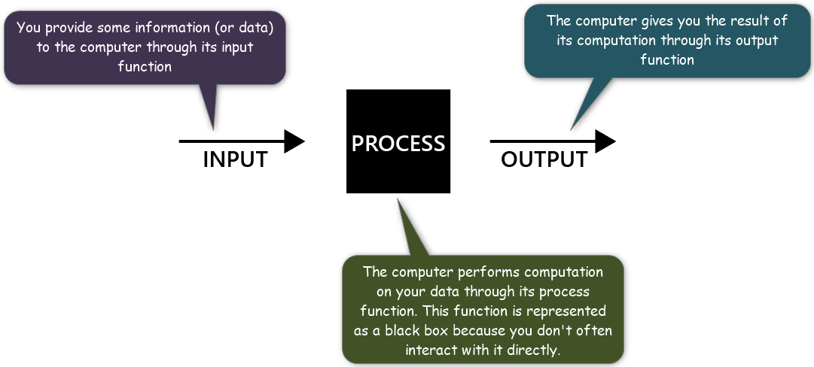

Any device worthy of the name, computer, must be capable of performing these functions. In fact, you can say any device that has these 3 functions is a computer.

| 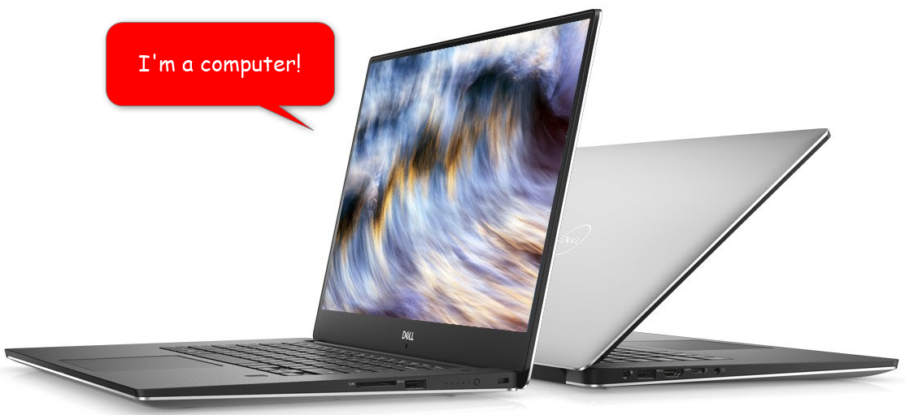| 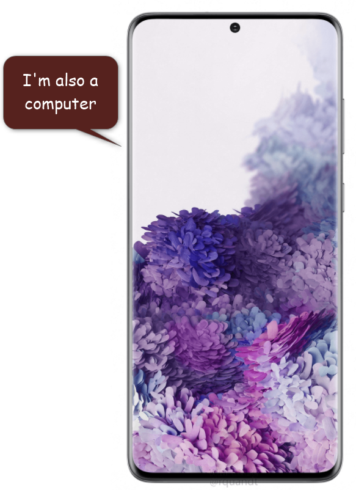 |
| -- | -- |
| 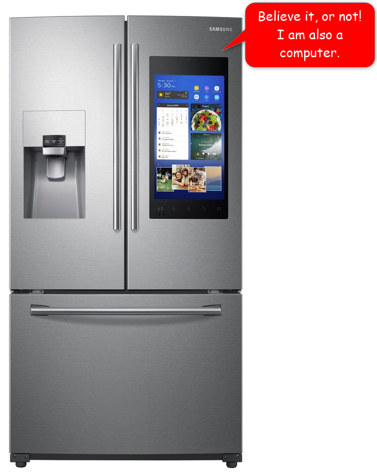|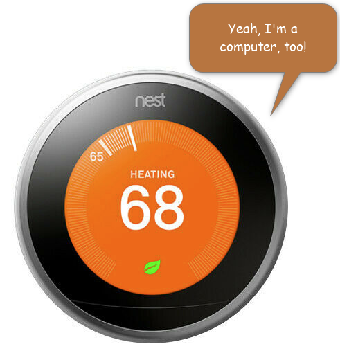 |

**The Computing System**

To think of a computer as a device is really a misnomer, because your computer is actually a system of devices, each with a very specific role geared towards one or more of the 3 functions described above.  

Every computer you have ever used, or you are using right now to read this text, comprises of **hardware** and **software**.

## 1.1 Hardware

Computer hardware are the physical components of the computing system. A typical computer, like the one you are using right now, has 10s of hardware components. These components can be categorized into; **input devices**, **processing devices** and **output devices**:

### 1.1.1 Input Devices

**Input** is any information or data you enter into your computer. As such, any physical device you use in the process of entering data into your computer is an input device. In modern computing systems, you will interact with these often.

Common input devices are:
| Keyboard | Camera | Graphic Tablet | Webcam | Mouse | Microphone |
| :--: | :--: | :--: | :--: | :--: | :--: |
| 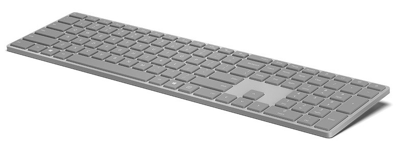 | 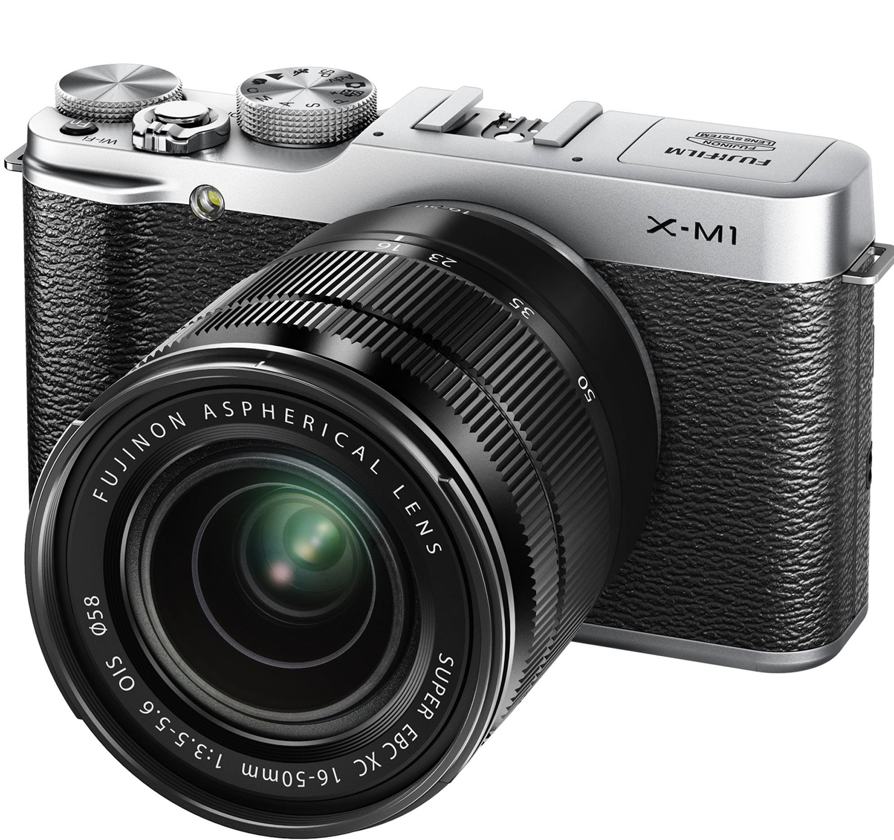 | 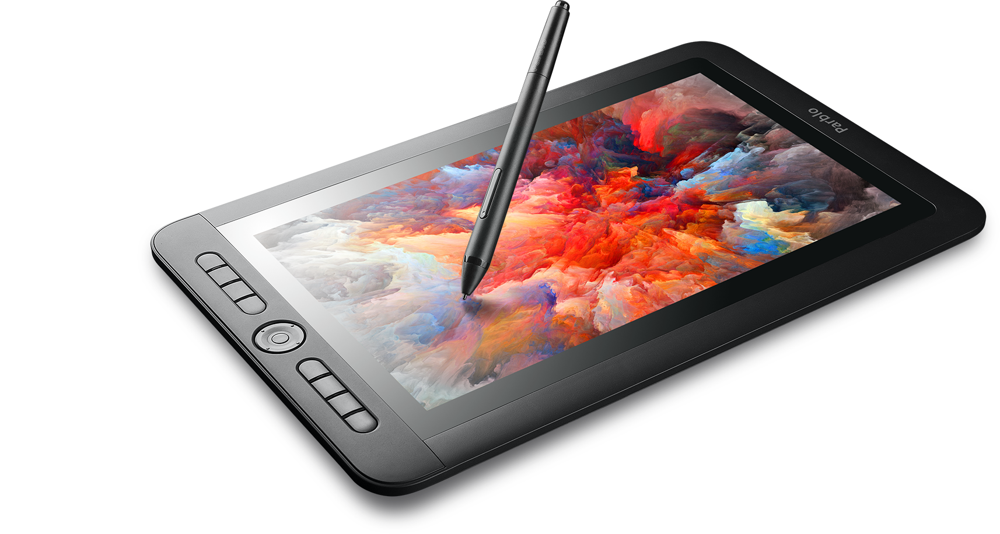 | 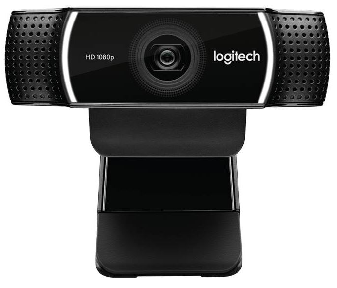 | 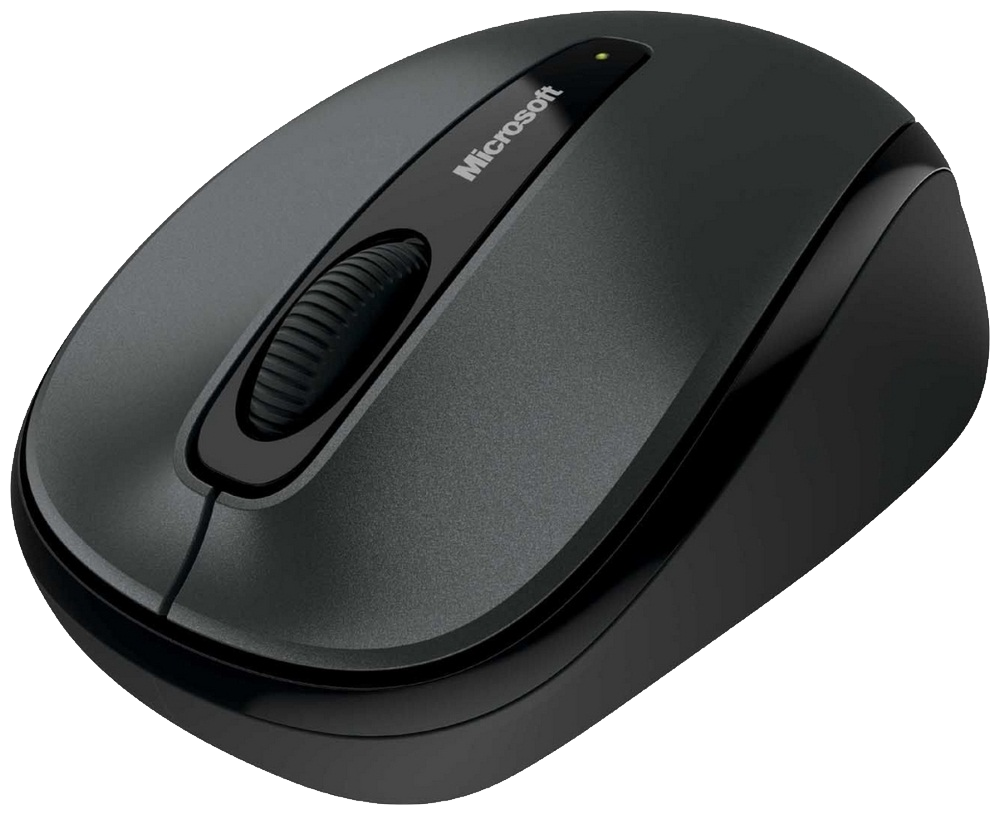 | 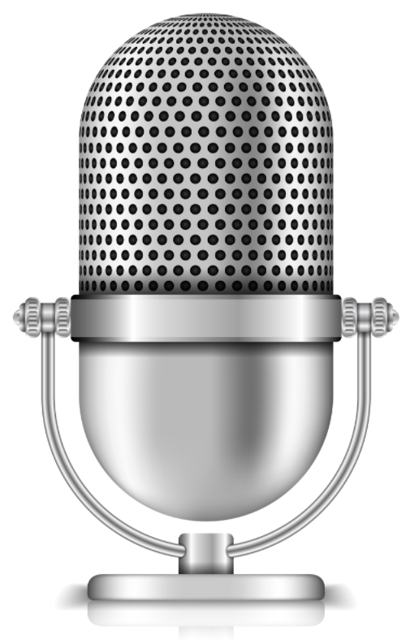 |

### 1.1.2 Processing Devices
    
Processing devices are the central nervous system of the computer. They are the reason the computer can compute. These devices include:

| Central Processing Unit (CPU or Processor) | Main Memory |
| :--: | :--: |
| 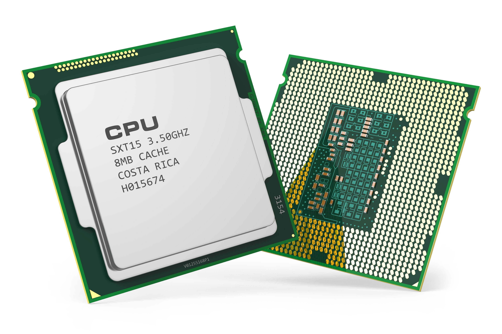 | 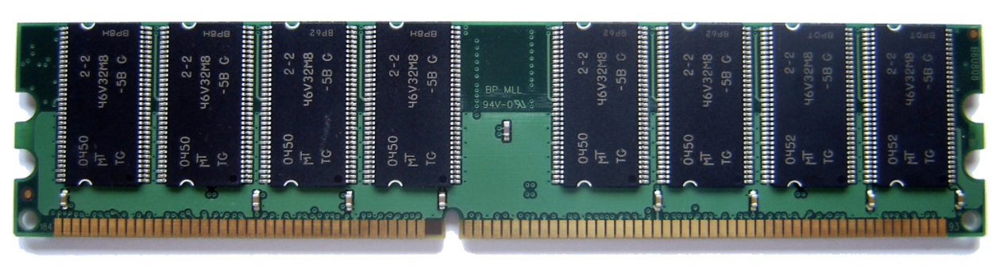 |

The CPU and the main memory are very sensitive devices. They are enclosed in the process layer of your computer. As such, you do not, usually, directly interact with them. Let's learn more about them below:

**The Central Processing Unit (CPU)**

The CPU is often referred to as the "brain of the computer." It's job is to accept your instructions, interpret your instructions, and then execute them to produce some resulting data. Inside the CPU are the **Control Unit (CU)** and the **Arithmetic Logic and Unit (ALU)**.

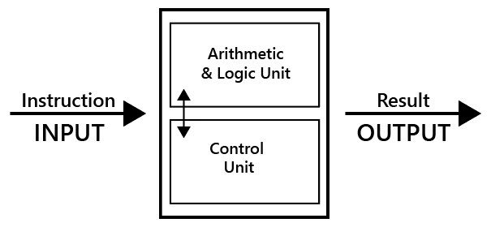

The **CU** is the coordinator of all CPU operations. It determines where to get your next instruction and coordinates other major components by sending them electrical signals containing control instructions.
	
The **ALU** performs mathematical and logical calculations for the CPU. It is also responsible for transforming textual instructions into binary code, the only language the computer understands.
            
The programs or apps you have installed on your computer (smartphone, tablet or laptop) are simply textual instructions stored on the computer's secondary memory (you will learn about this shortly). When you launch an app, your computer copies those instructions into the main memory and sends the CPU into a process known as the **fetch-decode-execute** cycle. 

The **fetch-decode-execute cycle** continues until the computer has executed all instructions in the app you are running. 
    
**The Main Memory**
    
The main memory is a Random Access Memory (RAM) that holds information (data and instructions) with which your computer is currently working. It is called a RAM because the information stored on it can be accessed in any order.

It is very volatile; meaning, it will lose all its information as soon as you turn off your computer. Because of its volatility, you can think of it like your short term memory. It is also the reason the first thing any tech support asks you to do when you call them is "turn off your computer and turn it back on." This is because when you are using your computer, the RAM could get corrupted and turning off your computer completely, and turning it back on, will clean it out and allow you to start at fresh.

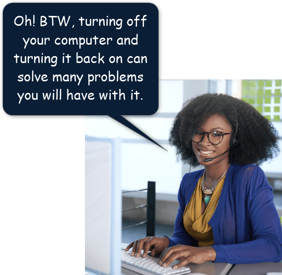

The main memory and the CPU have a relationship in that together, they determine the speed of your computer. The main memory has a size that can be measured in bytes. E.g. 8 GB, 16 GB, etc.

**_How does the **main memory** store your data?_**

Keep in mind that regardless of the fancy terms we use in this course, modern computers are simply a system of electrical devices. So, every component in them operates with electrical signals. The main memory is no exception. It is pretty much a circuit board with a bunch of electrical switches on it. Each switch is called a **bit** (or **bi**nary digi**t**). A bit is the most basic unit of data or information.

Just like the switches on your wall at home, a bit can be either on (represented mathematically with the number 1) or a bit can be off (represented mathematically with the number 0). The on and off positions or states of these bits (or switches), represented as 1s and 0s, define the computer's binary language. So, the binary language is a language with only 2 characters; 1 and 0. 

**Bits** on a circuit board are further organized in groups of 8, called a **byte**. Each byte has a unique number known as its **address**. A byte's address serves the same purpose as your home address and it is ordered from lowest to highest. 

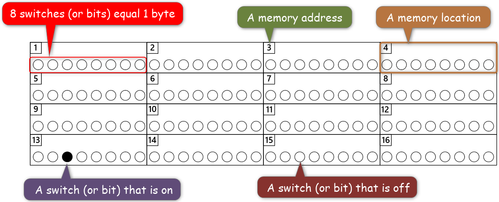

So, when the main memory stores your information, it arranges the bits at a given address in an on/off pattern that represents a character (letter, number, etc.). 

For example, if you entered the number 25 on your keyboard, the computer will convert 25 to binary (or base 2), which results in `0001 1001` (I used my programmer calculator to calculate this value). The computer then picks a random memory location (in this case, 8) to store the binary value of 25.

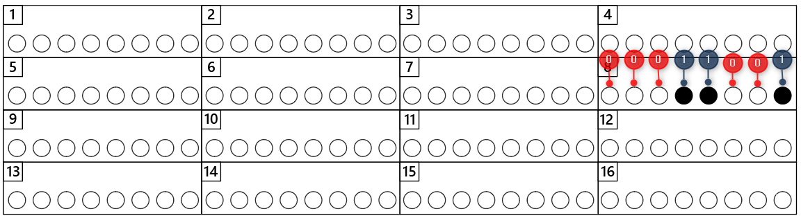

**_Data representation and the concept of Abstraction_**

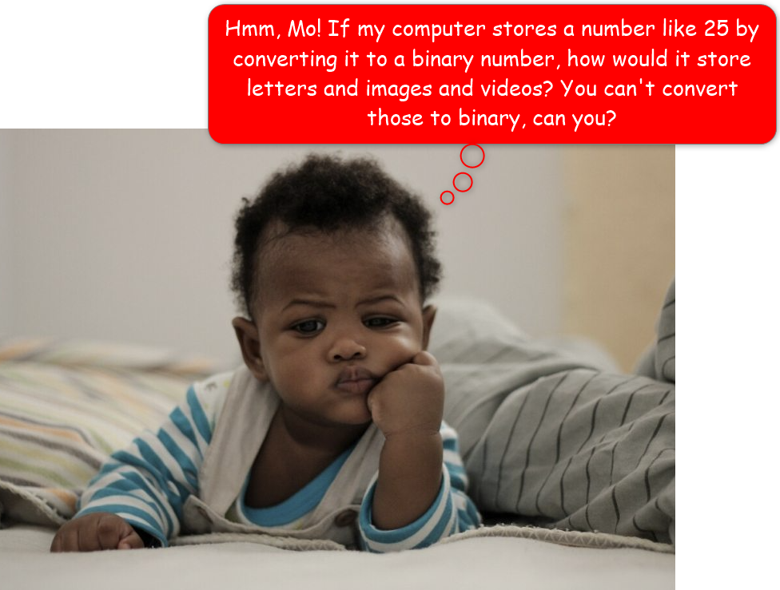
**Excellent thought, Jerome!** Not directly, no. However, if we figured out a way to represent characters and other data elements as numbers, we could!

Luckily for us, a group of really smart people came together a long time ago and came up with something called **ASCII** (American Standard Code for Information Interchange). ASCII is a standard which assigns a decimal number to a given character. For example, The capital letter A is assigned the decimal number 65, the capital letter B is assigned the number 66, and so forth.

You can find the full ASCII table [here](http://ascii-table.com/ascii.php).

    > The original ASCII standard only included 128 characters, as you can see in the table, linked above. 
    Obviously that doesn't account for all characters in all spoken languages in the world. A second version of the standard; **extended-ASCII**, includes an additional 128 characters to give us a total of 256 characters. This standard includes letters with accent, found in languages like French. 

Given the ASCII and extended-ASCII tables, if you wanted to store the letter A, you find its decimal number; 65, on the table, convert that to binary digits (bits) and store those digits in memory.

For example, when you send a text to your friend, with the message, "Hi," here is what happens:

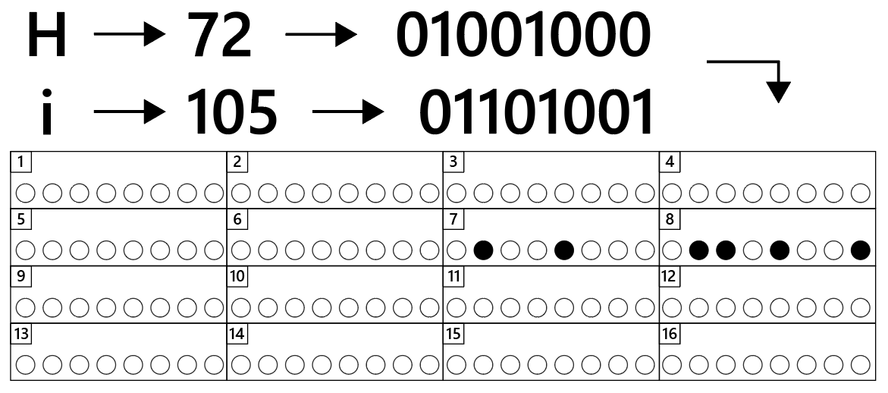

_Notice that the text, "Hi" is occupying 2 memory locations. When we start coding you will know why._

The same thing happens when you send your friend an image. The image is made of tiny squares called **pixels**. Each pixel is a spec of color on your screen. Color is a combination of Red, Green and Blue values called **channels**. Each channel can have a value of 0 - 255, where 0 means the color is missing from the pixel and 255 means the pixel has the full intensity of the color. Your computer simply takes the numeric values associated with the colors in the pixels, convert them to binary values and store those in memory.

To store your videos, your computer adds one more step from above. A video is a series of sequential images, called **frames**. Each frame contains several pixels. Your computer collects the numeric values of the channels within those pixels, convert them to binary and store them in memory.

As you can see, once you figure out how to represent any type of data as a number, the computer can store it because the computer is very good at converting from decimal numbers to binary numbers.

_Unicode Character Set_

The collection of characters in a given character standard is called a **character set**. As you might have noticed, we only need exactly 8 bits (or 1 byte) to store the largest character on the extended-ASCII table. This means the ASCII standard is an 8-bit character set. 

    > Collectively, ASCII and extended-ASCII has characters with decimal values from 0 to 255, where 0 is the smallest character and 255 is the largest character. 255 to binary is 1111 1111. When all the bits are 1 (or on) at any memory location, we say that location is full. So 255 will fill up any memory location where it is stored. Since it is the largest ASCII value and it is exactly 1 byte (8 bits = 1 byte), we say ASCII is an 8-bit standard.
        
Because both ASCII standards only account for 256 characters, it is obvious they do not account for all characters in most spoken languages. As such, the **Unicode** standard was created. The Unicode standard is a superset of the ASCII standard, meaning all the characters found in ASCII can be found in Unicode, plus a bunch more.

The Unicode character set has characters that require up to 32-bits (or 4 bytes). The emojis we love so much are also defined in the Unicode character set. For example, 😊 has the decimal value 4,036,991,114, which is equivalent to the following bits: 11110000 10011111 10011000 10001010. As you can see, we need up to 32 bits to represent our beloved smiling face with smiling eyes emoji. There is no way we could store emojis with the ASCII standard.

😊 = 4,036,991,114 = 11110000 10011111 10011000
        
_Emoji is a whole new language that has its own set of characters, just like English or Spanish._
    
_Abstraction_

What if you had to compile the frames in a YouTube video, collect their pixels and add up all the numeric values for each color channel, then convert all those numbers to binary in order to store them in your computer's memory, just so you can watch a grandma sleep with chocolate on her face? What if you had to do all that work?

**Exactly!** You will definitely not watch YouTube videos, ever!

Lucky for you, your computer employs a concept known as **abstraction**. Abstraction allows your computer to hide all the details of converting frames to images, and images to pixels, and pixels to decimal numbers, and decimal numbers to binary numbers. Instead it presents you with an interface where you can search for a video and click a single button to play your YouTube videos. This is why your computer is so useful. It takes away all the tedious tasks, and give you an easy way to enjoy your work or your entertainment.

FYI, abstraction is all around us; not only in computer science. It is, for instance, the reason you can learn to drive a car without worrying about how a car works internally. It is also the reason that when you learn to drive one car, you can pretty much drive any other car in the same category. If you had to think about what happens in a car's engine every time you pressed the gas, you probably would never drive. So abstraction is a very important concept not only in computer science, but in all our lives.

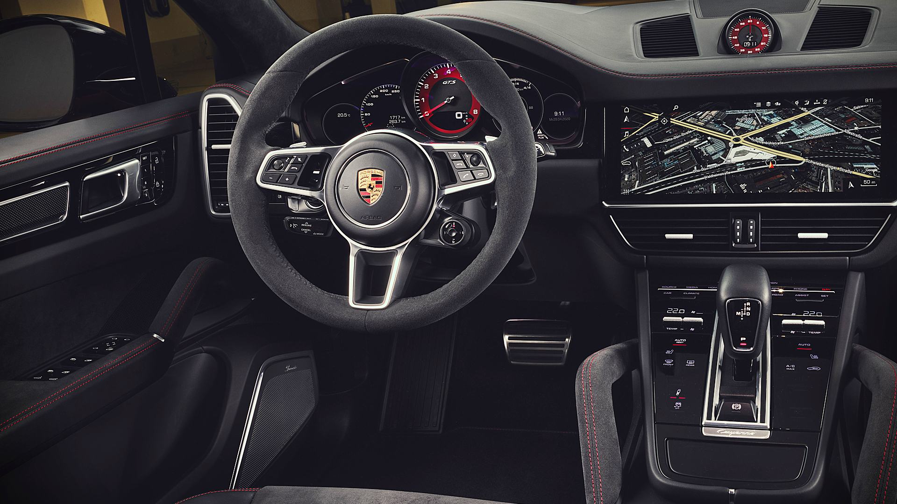

_As beautiful and straightforward as the interior of this Porsche Cayenne looks, it is an abstraction of really complex operations that occur in a combustion engine._

### 1.1.3 Output Devices

**Output** is any data or information you get from your computer. As a result, any physical device you use to retrieve data from your computer is an output device. 
	
Your computer output can be **soft**, displayed on some device that is part of the computing system, like a screen, or it can be **hard**, output to an object external to the computing system, like a paper, a billboard or a magazine.

Common output devices are:
| Printer | Memory Card* | Monitor | Tablet Screen* | Flash Drive* |
| -- | -- | -- | -- | -- |
| 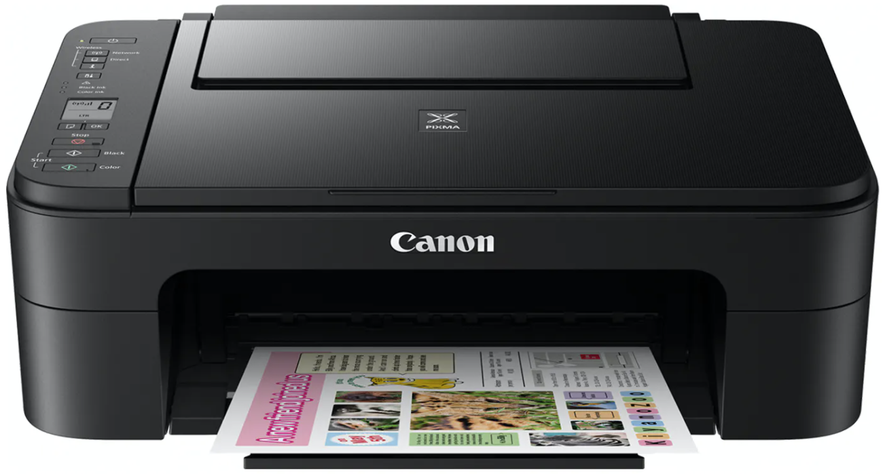 | 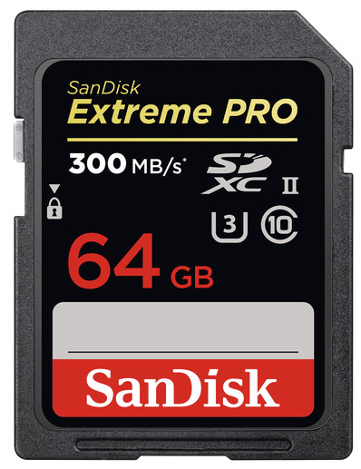 | 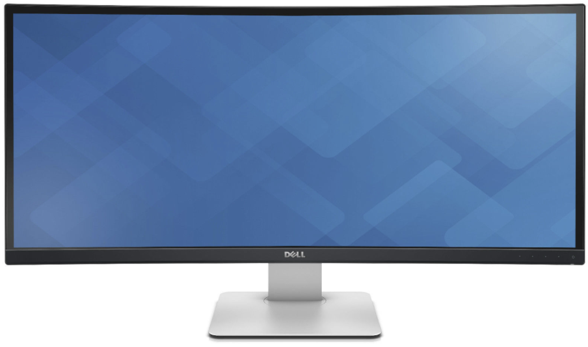 | 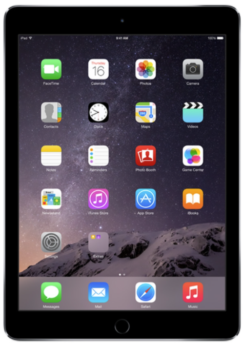 | 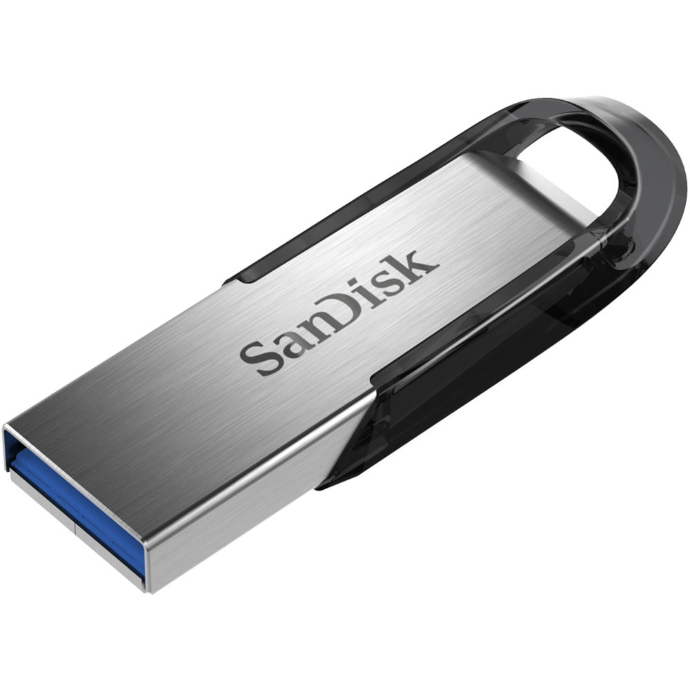 |
| _Produces hard copy_ | _Produces soft copy_ | _Produces soft copy_ | _Produces soft copy_ | _Produces soft copy_ |
    
_* Some devices are both input and output devices. For example, your computer can save (output) images to a flash drive. It can also load (input) images from a flash drive for editing._

**Secondary Memory**

We described the main memory earlier as a short term memory that will lose its data when you shut your computer down. Well, if the main memory were the only type of storage, your computer would be a very forgetful device, 😂. 
	
Storage manufacturers also provide another type of storage device called **secondary memory**. These devices store data permanently, so you can think of them like your long term memory. Every computer comes with one; even yours!
	
Just like your long term memory, data stored on a secondary memory is there forever, unless explicitly deleted or lost from some catastrophic event. Secondary memory devices also come in larger sizes than main memory. For example, your computer probably has a main memory that is 8 GB in size, but your secondary memory (hard drive or SSD) is probably 256 GB. This is because the main memory is faster, but more expensive. The larger your computer's main memory, the more expensive your computer. 
	
**Examples of secondary memories include:** Hard Disk Drives, Solid State Drives (SSDs), Memory Card, Flash Drive, etc.

	

    

