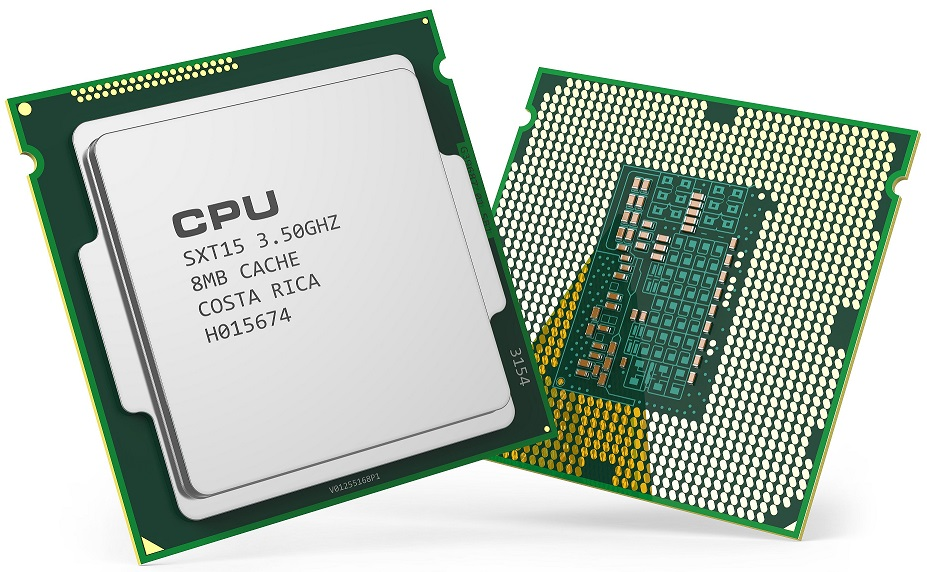
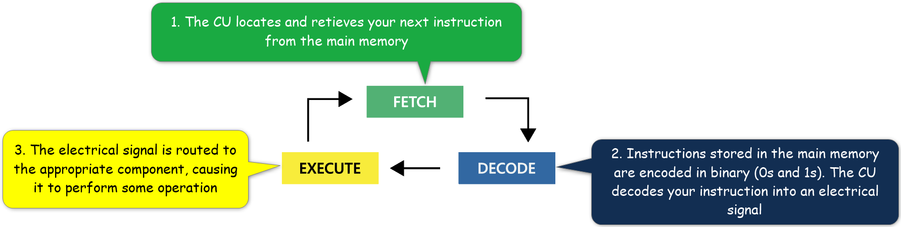

# 1. What is a Computer?

| CONCEPT | A Computer is a computational device, designed specifically so that it can follow instructions to accomplish tasks. |
| :---: | :-----------: |

Fundamentally, a computer, like its name suggests, is a computational device. It is designed to **take in** some information, **perform some computation** on that information, and produce some **output**. These functions, neatly categorized into **INPUT**, **PROCESS** and **OUTPUT**, define the nature of any computer, regardless of its size, form or industry.

Any device worthy of the name, computer, must be capable of performing these functions. In fact, you can say any device that has these 3 functions is a computer.

| |  |
| -- | -- |
| | |

## 1.1 The Computing System

To think of a computer as a device is really a misnomer, because your computer is actually a system of devices, each with a very specific role geared towards one or more of the 3 functions described above.  

Every computer you have ever used, or you are using right now to read this text, comprises of **hardware** and **software**.

### 1.1.1 Hardware

Computer hardware are the physical components of the computing system. A typical computer, like the one you are using right now, has 10s of hardware components. These components can be categorized into; **input devices**, **processing devices** and **output devices**:

1. **Input Devices**
    
    **Input** is any information or data you enter into your computer. As such, any physical device you use in the process of entering data into your computer is an input device. In modern computing systems, you will interact with these often.

    Common input devices are:
    | Keyboard | Camera | Graphic Tablet | Webcam | Mouse | Microphone |
    | :--: | :--: | :--: | :--: | :--: | :--: |
    |  |  |  |  |  |  |

2. **Processing Devices**
    
    Processing devices are the central nervous system of the computer. They are the reason the computer can compute. These devices include:

    | Central Processing Unit (CPU or Processor) | Main Memory |
    | :--: | :--: |
    |  |  |

    The CPU and the main memory are very sensitive devices. They are enclosed in the process layer of your computer. As such, you do not, usually, directly interact with them. Let's learn more about them below:

    - _**The Central Processing Unit (CPU)**_

        The CPU is often referred to as the "brain of the computer." It's job is to accept your instructions, interpret your instructions, and then execute them to produce some resulting data. Inside the CPU are the **Control Unit (CU)** and the **Arithmetic Logic and Unit (ALU)**.

        

        The **CU** is the coordinator of all CPU operations. It determines where to get your next instruction and coordinates other major components by sending them electrical signals containing control instructions.
	
        The **ALU** performs mathematical and logical calculations for the CPU. It is also responsible for transforming textual instructions into binary code, the only language the computer understands.
            
        The programs or apps you have installed on your computer (smartphone, tablet or laptop) are simply textual instructions stored on the computer's secondary memory (you will learn about this shortly). When you launch an app, your computer copies those instructions into the main memory and sends the CPU into a process known as the **fetch-decode-execute** cycle. 

        

        The **fetch-decode-execute cycle** continues until the computer has executed all instructions in the app you are running. 
    
    - _**The Main Memory**_
    
        The main memory is a Random Access Memory (RAM) that holds information (data and instructions) with which your computer is currently working. It is called a RAM because the information stored on it can be accessed in any order.

        It is very volatile; meaning, it will lose all its information as soon as you turn off your computer. Because of its volatility, you can think of it like your short term memory. It is also the reason the first thing any tech support asks you to do when you call them is "turn off your computer and turn it back on." This is because when you are using your computer, the RAM could get corrupted and turning off your computer completely, and turning it back on, will clean it out and allow you to start at fresh.

        

        The main memory and the CPU have a relationship in that together, they determine the speed of your computer. The main memory has a size that can be measured in bytes. E.g. 8 GB, 16 GB, etc.

        _**How does the main memory store your data?**_

        Keep in mind that regardless of the fancy terms we use in this course, modern computers are simply a system of electrical devices. So, every component in them operates with electrical signals. The main memory is no exception. It is pretty much a circuit board with a bunch of electrical switches on it. Each switch is called a **bit** (or **bi**nary digi**t**). A bit is the most basic unit of data or information.

        Just like the switches on your wall at home, a bit can be either on (represented mathematically with the number 1) or a bit can be off (represented mathematically with the number 0). The on and off positions or states of these bits (or switches), represented as 1s and 0s, define the computer's binary language. So, the binary language is a language with only 2 characters; 1 and 0. 

        **Bits** on a circuit board are further organized in groups of 8, called a **byte**. Each byte has a unique number known as its **address**. A byte's address serves the same purpose as your home address and it is ordered from lowest to highest. 

        

        So, when the main memory stores your information, it arranges the bits at a given address in an on/off pattern that represents a character (letter, number, etc.). 

        For example, if you entered the number 25 on your keyboard, the computer will convert 25 to binary (or base 2), which results in `0001 1001` (I used my programmer calculator to calculate this value). The computer then picks a random memory location (in this case, 8) to store the binary value of 25.

        

        _**Data representation and the concept of Abstraction**_

        
        **Excellent thought, Jerome!** Not directly, no. However, if we figured out a way to represent characters and other data elements as numbers, we could!

        Luckily for us, a group of really smart people came together a long time ago and came up with something called **ASCII** (American Standard Code for Information Interchange). ASCII is a standard which assigns a decimal number to a given character. For example, The capital letter A is assigned the decimal number 65, the capital letter B is assigned the number 66, and so forth.

        You can find the full ASCII table [here](http://ascii-table.com/ascii.php).

        > The original ASCII standard only included 128 characters, as you can see in the table, linked above. Obviously, that does not account for all characters in all spoken languages in the world. A second version of the standard; **extended-ASCII**, includes an additional 128 characters to give us a total of 256 characters. This standard includes letters with accent, found in languages like French. 

        Given the ASCII and extended-ASCII tables, if you wanted to store the letter A, you find its decimal number; 65, on the table, convert that to binary digits (bits) and store those digits in memory.

        For example, when you send a text to your friend, with the message, "Hi," here is what happens:

        
        _Notice that the text, "Hi" is occupying 2 memory locations. When we start coding you will know why._

        

    

