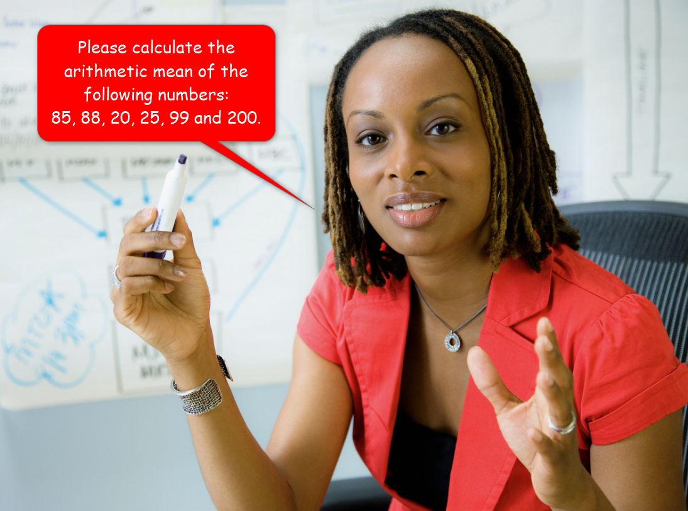

# 2. Elements of Software Engineering

| CONCEPT | Software engineering is the scientific and artistic craft of designing and writing computer programs. A computer program is a sequence of instructions your computer follows to solve a given problem. To write a computer program, you must learn at least one computer programming language. |
| :---: | :-----------: |

By now you are probably anxious to start coding. However, before you write your first line of code, I would like you to get acquainted with some fundamental concepts, so that when you do start coding, you won't be completely in the dark. 

Among these concepts are: Computer Programs, Programming Languages and their paradigms, Software Development Kits (SDKs), Compilers, machine code, programming tools, etc.

## 2.1 What is a Computer Program?

> A computer program (or a software or an app) is a sequence of instructions your computer follows to complete a task.

You see, your computer is not really as smart as you might think. The only superpowers it really has are its ability to follow instructions and its speed. Fundamentally, your computer is designed to follow your instructions. A computer program is simply your way of communicating your instructions to your computer. The trouble is, your computer is really stupid. So, if you want it to understand you, you must be absolutely **unambiguous** when you tell it what to do.

For example, if I wanted you to calculate the arithmetic mean of a series of numbers, I could give you the instruction as follows _(that's not really me in the picture; lol)_:



Given the above instruction, you would probably come up with the following solution _(that's not really you in the picture either, lol)_:


Between you and me, your approach here would not only be satisfactory, it would be correct! But your computer would be like:


For your computer to really get what you are saying, you must speak slowly and clearly. That could go something like this:

1. Add 85 and 88 to get 173
2. Add 173 and 20 to get 193
3. Add 193 and 25 to get 218
4. Add 218 and 99 to get 317
5. Add 317 and 200 to get 517
6. Divide 517 by 6 to get 86.16666666666666666666666…
7. Round 86.16666666666666… to the nearest 5 significant digits

At this point, you might think you have clearly stated what you want your computer to do. Assuming your computer knows what "Add", "Get", "Divide" and "Round" mean, it will correctly perform the operations and give you the result.

Truth be told, your computer will not even understand the enumerated steps above, because: 
1. Those steps are written in plain English and your computer doesn't understand plain English
2. Your computer is still in the dark about the words (commands) "Add", "Divide", "Get" and "Round". 

To bring your computer up to speed, you must specify the above steps, fancily called algorithm, in a computer program, using a computer programming language.

### 2.1.1 Algorithm

In the above section, I used two different methods to specify instructions for accomplishing the task of calculating the arithmetic mean of a series of numbers; I spoke it out to you, and I created an ordered list of steps. In both methods, what I have really done is specify an **algorithm**.

> In computer science, an **algorithm** is a sequence of well defined steps for performing a task or for solving a problem.

When you write (yes, you do write) a computer program, you are actually writing an algorithm for each problem you wish your computer to solve.


When you write algorithms for yourself or for your friends or for me, you can write them in plain English, or in Spanish or in Hindi or in pretty much any language you can speak. 

Infact, another way to express your algorithm to other intelligent species is to write it in a mathematical equation. For example, I could have expressed the above arithmetic mean algorithm as follows:


Any intelligent species reading this will understand exactly what to do, given N numbers (Hopefully you remember this from high school Algebra). The trouble is, your computer is not an intelligent species; at least, not yet 🤷🏿‍♀️. In fact, it can't even speak the same language(s) you can! It can only speak machine language (or machine code or binary language), a language you cannot speak! 😩.

A final way to express an algorithm is to write it in what is known as **pseudocode**. 

> **Pseudocode** is an artificial and informal language, usually written in plain English (or any spoken language), but in the structure of programming languages. Its structure is in the form of programming languages to keep it concise. 

For example, I could have expressed the mean algorithm as follows:

```java
1. Declare numbers
2. Set numbers = 85, 88, 20, 25, 99, 200
3. Declare sum
4. Set sum = 0
5. Declare count
6. Set count = length of numbers
7. Declare index 
8. Set index = 0 (0 indicates the first number in the numbers list)
9. while index < count
        add number at index to sum
	    add 1 to index
10. Declare mean
11. Set mean = sum / count
12. Print mean
```

As you can see, this form of algorithmic expression is both close to code and close to a spoken language. Nonetheless, while it might help you formulate your algorithm and communicate it to others, your computer still cannot understand it. 

If you remember from lesson 1, I said when you launch an app on your computer, it loads the code for that app from its secondary memory into its main memory. That main memory can only store information if the information is encoded as 1s and 0s (binary or machine code). Your computer's CPU also needs your instructions to be in binary because the ALU and CU that make it up can only understand binary. So, if you really want your computer to understand your algorithm (or program), you must write it in binary.

At this point, you are like:


**Ah relax!** I'm not really suggesting you learn to write an entire program in binary, on top of all the other junk you have to learn. Come on! Learning to write an entire program in binary is impossible!

I'm merely pointing out the fact that you and your computer speak different languages. To foster communication between you two, given how cozy you are with one another (😂), you need a middle ground. You need to be able to express your algorithms in a language that is easier for you to learn and understand, and that can be translated into binary code.


### 2.1.2 Test your knowledge

## 2.2 Programming Languages

To get your computer to do anything, you must tell it what to do in the form of an algorithm, expressed in a computer program. Your program though, can't simply be written in plain English or your native language, because there is a language barrier between you and your computer.

> A programming language is a formal, non-spoken, language used to express algorithms in a computer program. 

Because of this language barrier, you must learn, at least, one programming language. The original programming language is the **binary language (or machine code)**; the computer's own language. Back in the day, when we first started writing computer programs, we tried writing programs in binary. 😂!! It did not go well! The process was ridiculously tedious! Not to mention, it was also terribly error prone. Most importantly, it was very limiting! Writing complex programs was impossible! This is mainly because the binary language is very far away from spoken languages. It's all 1s and 0s, and it's very difficult to learn and tedious to write:

```java
0 1 0 0 1 0 0 0 0 1 1 0 0 1 0 1 0 1 1 0 1 1 0 0 0 1 1 0 1 1 0 0 0 1 1 0 1 1 1 1 0 0 1 0 0 0 0 0 0 1 0 1 0 1 1 1 0 1 1 0 1 1 1 1 0 1 1 1 0 0 1 0 0 1 1 0 1 1 0 0 0 1 1 0 0 1 0 0 0 0 1 0 0 0 0 1
```

Consider the program above, it simply prints, "Hello, World!" to your screen. Imagine writing a significantly more complex program in binary. Could you do it?


### 2.2.1 Assembly Language

Because of the difficulty in learning and using the binary language, **assembly language** was created! In assembly, you write your program using mnemonics (short forms of words). Yeah I know what you're thinking. No, it wasn't the same as writing LOL in text messages. It was similar, but not the same.

For example, here is the "Hello, World!" program, from above, re-written in assembly language.

```java
global  _main
    extern  _printf

    section .text
_main:
    push    message
    call    _printf
    add     esp, 4
    ret
message:
    db  'Hello, World', 10, 0
```

As mentioned above, this program does exactly the same thing as the previous one, but the assembly code is more readable. If you look closely, you can even recognize instructions like "push," "add," etc. You can even recognize the text it is printing. Because of your ability to recognize these words, assembly was relatively easier to learn. As a result, it became very popular.

When you write your code in assembly, your computer no longer understands it, because again, your computer only understands binary. To solve that problem, the **assembler** was invented. 

> An **assembler** is a tool (another computer program) that sits between your assembly code and your computer's CPU. You write your program in assembly, the assembler assembles (translates) your program's code into machine code (binary), and your computer can happily execute your code.


> A file containing computer program code is called a **source code file**

While assembly language is relatively easier to learn, it has the same drawbacks as machine code when you start writing more complex programs. 

Collectively, machine code and assembly are known as **low level programming languages**. They are so-called because they are very close to your computer's CPU, and their closeness to your computer's CPU is why they are difficult to learn and to use.

### 2.2.2 Higher Level Programming Languages

You have come this far with me and so, you know the struggle, 🤷🏿‍♀️. We tried writing code in binary, but there were too many 1s and 0s for us to comprehend. We then moved on to assembly, but it was too cryptic for us.


Now, what do we do? Queue in higher level programming languages. These are programming languages that are very close to spoken languages. In fact, they are so close to spoken languages that you can recognize every character and every word in their programs. For example, here is the same "Hello, World!" program, re-written in a higher level programming language.

```java
public class HelloWorld {
    public static void main(String[] args) {
        System.out.println ("Hello, World!");
    }
}
```


**Yay, indeed!**

With higher level programming languages, you can write your code in a language that is very close to a spoken language, and have your code translated to assembly language, which an assembler can translate to machine code.

> A **compiler** is a computer program (a tool) that compiles (translates) your code written in one programming language; usually a higher level language, into another, usually lower level, programming language.


Most modern higher level languages come with compilers that know how to compile their code directly to machine code, eliminating the extra steps:


#### 2.2.2.1 Higher Level Language Paradigms

Once we figured out how to create compilers, there became a massive proliferation of higher level programming languages. In fact, there have been several new higher level programming languages as recent as 2014. We are introducing new higher level programming languages all the time. Because of this massive proliferation, we have organized higher level programming languages into paradigms. 

> Languages in the same paradigm usually share similar characteristics and features.


I'm not going to bore you with the details of all the different paradigms. I don't want you to hate me before the semester even begins, 😁. If you are really interested (good for you!), you can look them up [here](https://cs.lmu.edu/~ray/notes/paradigms/ "Programming Lanaguage Paradigms").

For the benefit of this class, we will discuss the **Object-Oriented Programming** language paradigm.

#### 2.2.2.2 Object-Oriented Programming (OOP) Languages

The earliest programming languages were **procedural**. They expressed programs in the form of one or more procedures.

> A **procedure** is a set of related programming statements that perform a task. To solve their problem, they can accept input from a user, perform actions on that input, and pass data around to other procedures.
