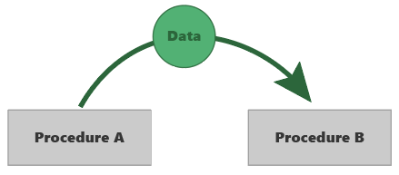
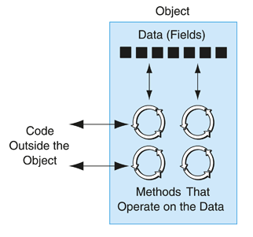
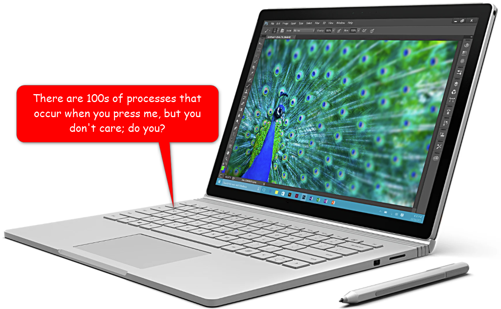
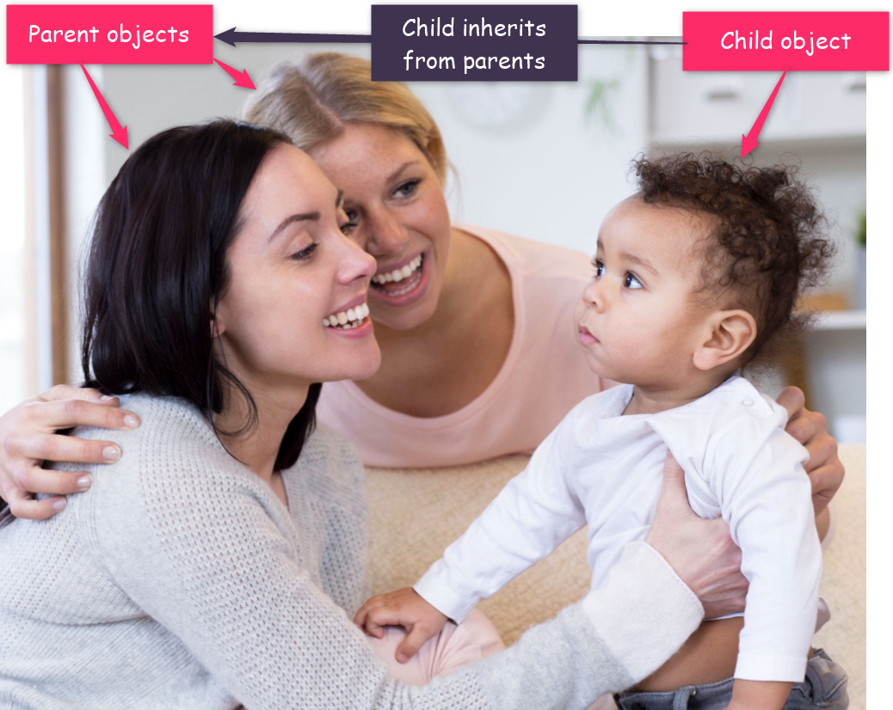

# 2. Elements of Software Engineering

| CONCEPT | Software engineering is the scientific and artistic craft of designing and writing computer programs. A computer program is a sequence of instructions your computer follows to solve a given problem. To write a computer program, you must learn at least one computer programming language. |
| :---: | :-----------: |

By now you are probably anxious to start coding. However, before you write your first line of code, I would like you to get acquainted with some fundamental concepts, so that when you do start coding, you won't be completely in the dark. 

Among these concepts are: Computer Programs, Programming Languages and their paradigms, Software Development Kits (SDKs), Compilers, machine code, programming tools, etc.

## 2.1 What is a Computer Program?

> A computer program (or a software or an app) is a sequence of instructions your computer follows to complete a task.

You see, your computer is not really as smart as you might think. The only superpowers it really has are its ability to follow instructions and its speed. Fundamentally, your computer is designed to follow your instructions. A computer program is simply your way of communicating your instructions to your computer. The trouble is, your computer is really stupid. So, if you want it to understand you, you must be absolutely **unambiguous** when you tell it what to do.

For example, if I wanted you to calculate the arithmetic mean of a series of numbers, I could give you the instruction as follows _(that's not really me in the picture; lol)_:


Given the above instruction, you would probably come up with the following solution _(that's not really you in the picture either, lol)_:


Between you and me, your approach here would not only be satisfactory, it would be correct! But your computer would be like:


For your computer to really get what you are saying, you must speak slowly and clearly. That could go something like this:

1. Add 85 and 88 to get 173
2. Add 173 and 20 to get 193
3. Add 193 and 25 to get 218
4. Add 218 and 99 to get 317
5. Add 317 and 200 to get 517
6. Divide 517 by 6 to get 86.16666666666666666666666…
7. Round 86.16666666666666… to the nearest 5 significant digits

At this point, you might think you have clearly stated what you want your computer to do. Assuming your computer knows what "Add", "Get", "Divide" and "Round" mean, it will correctly perform the operations and give you the result.

Truth be told, your computer will not even understand the enumerated steps above, because: 
1. Those steps are written in plain English and your computer doesn't understand plain English
2. Your computer is still in the dark about the words (commands) "Add", "Divide", "Get" and "Round". 

To bring your computer up to speed, you must specify the above steps, fancily called algorithm, in a computer program, using a computer programming language.

### 2.1.1 Algorithm

In the above section, I used two different methods to specify instructions for accomplishing the task of calculating the arithmetic mean of a series of numbers; I spoke it out to you, and I created an ordered list of steps. In both methods, what I have really done is specify an **algorithm**.

> In computer science, an **algorithm** is a sequence of well defined steps for performing a task or for solving a problem.

When you write (yes, you do write) a computer program, you are actually writing an algorithm for each problem you wish your computer to solve.


When you write algorithms for yourself or for your friends or for me, you can write them in plain English, or in Spanish or in Hindi or in pretty much any language you can speak. 

Infact, another way to express your algorithm to other intelligent species is to write it in a mathematical equation. For example, I could have expressed the above arithmetic mean algorithm as follows:


Any intelligent species reading this will understand exactly what to do, given N numbers (Hopefully you remember this from high school Algebra). The trouble is, your computer is not an intelligent species; at least, not yet 🤷🏿‍♀️. In fact, it can't even speak the same language(s) you can! It can only speak machine language (or machine code or binary language), a language you cannot speak! 😩.

A final way to express an algorithm is to write it in what is known as **pseudocode**. 

> **Pseudocode** is an artificial and informal language, usually written in plain English (or any spoken language), but in the structure of programming languages. Its structure is in the form of programming languages to keep it concise. 

For example, I could have expressed the mean algorithm as follows:

```java
1. Declare numbers
2. Set numbers = 85, 88, 20, 25, 99, 200
3. Declare sum
4. Set sum = 0
5. Declare count
6. Set count = length of numbers
7. Declare index 
8. Set index = 0 (0 indicates the first number in the numbers list)
9. while index < count
        add number at index to sum
	    add 1 to index
10. Declare mean
11. Set mean = sum / count
12. Print mean
```

As you can see, this form of algorithmic expression is both close to code and close to a spoken language. Nonetheless, while it might help you formulate your algorithm and communicate it to others, your computer still cannot understand it. 

If you remember from lesson 1, I said when you launch an app on your computer, it loads the code for that app from its secondary memory into its main memory. That main memory can only store information if the information is encoded as 1s and 0s (binary or machine code). Your computer's CPU also needs your instructions to be in binary because the ALU and CU that make it up can only understand binary. So, if you really want your computer to understand your algorithm (or program), you must write it in binary.

At this point, you are like:


**Ah relax!** I'm not really suggesting you learn to write an entire program in binary, on top of all the other junk you have to learn. Come on! Learning to write an entire program in binary is impossible!

I'm merely pointing out the fact that you and your computer speak different languages. To foster communication between you two, given how cozy you are with one another (😂), you need a middle ground. You need to be able to express your algorithms in a language that is easier for you to learn and understand, and that can be translated into binary code.


### 2.1.2 Test your knowledge

## 2.2 Programming Languages

To get your computer to do anything, you must tell it what to do in the form of an algorithm, expressed in a computer program. Your program though, can't simply be written in plain English or your native language, because there is a language barrier between you and your computer.

> A programming language is a formal, non-spoken, language used to express algorithms in a computer program. 

Because of this language barrier, you must learn, at least, one programming language. The original programming language is the **binary language (or machine code)**; the computer's own language. Back in the day, when we first started writing computer programs, we tried writing programs in binary. 😂!! It did not go well! The process was ridiculously tedious! Not to mention, it was also terribly error prone. Most importantly, it was very limiting! Writing complex programs was impossible! This is mainly because the binary language is very far away from spoken languages. It's all 1s and 0s, and it's very difficult to learn and tedious to write:

```java
0 1 0 0 1 0 0 0 0 1 1 0 0 1 0 1 0 1 1 0 1 1 0 0 0 1 1 0 1 1 0 0 0 1 1 0 1 1 1 1 0 0 1 0 0 0 0 0 0 1 0 1 0 1 1 1 0 1 1 0 1 1 1 1 0 1 1 1 0 0 1 0 0 1 1 0 1 1 0 0 0 1 1 0 0 1 0 0 0 0 1 0 0 0 0 1
```

Consider the program above, it simply prints, "Hello, World!" to your screen. Imagine writing a significantly more complex program in binary. Could you do it?


### 2.2.1 Assembly Language

Because of the difficulty in learning and using the binary language, **assembly language** was created! In assembly, you write your program using mnemonics (short forms of words). Yeah I know what you're thinking. No, it wasn't the same as writing LOL in text messages. It was similar, but not the same.

For example, here is the "Hello, World!" program, from above, re-written in assembly language.

```java
global  _main
    extern  _printf

    section .text
_main:
    push    message
    call    _printf
    add     esp, 4
    ret
message:
    db  'Hello, World', 10, 0
```

As mentioned above, this program does exactly the same thing as the previous one, but the assembly code is more readable. If you look closely, you can even recognize instructions like "push," "add," etc. You can even recognize the text it is printing. Because of your ability to recognize these words, assembly was relatively easier to learn. As a result, it became very popular.

When you write your code in assembly, your computer no longer understands it, because again, your computer only understands binary. To solve that problem, the **assembler** was invented. 

> An **assembler** is a tool (another computer program) that sits between your assembly code and your computer's CPU. You write your program in assembly, the assembler assembles (translates) your program's code into machine code (binary), and your computer can happily execute your code.


> A file containing computer program code is called a **source code file**

While assembly language is relatively easier to learn, it has the same drawbacks as machine code when you start writing more complex programs. 

Collectively, machine code and assembly are known as **low level programming languages**. They are so-called because they are very close to your computer's CPU, and their closeness to your computer's CPU is why they are difficult to learn and to use.

### 2.2.2 Higher Level Programming Languages

You have come this far with me and so, you know the struggle, 🤷🏿‍♀️. We tried writing code in binary, but there were too many 1s and 0s for us to comprehend. We then moved on to assembly, but it was too cryptic for us.


Now, what do we do? Queue in higher level programming languages. These are programming languages that are very close to spoken languages. In fact, they are so close to spoken languages that you can recognize every character and every word in their programs. For example, here is the same "Hello, World!" program, re-written in a higher level programming language.

```java
public class HelloWorld {
    public static void main(String[] args) {
        System.out.println ("Hello, World!");
    }
}
```


**Yay, indeed!**

With higher level programming languages, you can write your code in a language that is very close to a spoken language, and have your code translated to assembly language, which an assembler can translate to machine code.

> A **compiler** is a computer program (a tool) that compiles (translates) your code written in one programming language; usually a higher level language, into another, usually lower level, programming language.


Most modern higher level languages come with compilers that know how to compile their code directly to machine code, eliminating the extra steps:


#### 2.2.2.1 Higher Level Language Paradigms

Once we figured out how to create compilers, there became a massive proliferation of higher level programming languages. In fact, there have been several new higher level programming languages as recent as 2014. We are introducing new higher level programming languages all the time. Because of this massive proliferation, we have organized higher level programming languages into paradigms. 

> Languages in the same paradigm usually share similar characteristics and features.


I'm not going to bore you with the details of all the different paradigms. I don't want you to hate me before the semester even begins, 😁. If you are really interested (good for you!), you can look them up [here](https://cs.lmu.edu/~ray/notes/paradigms/ "Programming Lanaguage Paradigms").

For the benefit of this class, we will discuss the **Object-Oriented Programming** language paradigm.

#### 2.2.2.2 Object-Oriented Programming (OOP) Languages

The earliest programming languages were **procedural**. They expressed programs in the form of one or more procedures.

> A **procedure** is a set of related programming statements that perform a task. To solve their problem, they can accept input from a user, perform actions on that input, and pass data around to other procedures.



One important thing I want you to note about the procedural style is that it separates the data from the procedures that operate on the data. This is important because if you look around you, this is not how things exist in nature.

Consider you, for instance. You have hair color, eyes, height, weight, complexion, etc. All the things that identify you are data about who you are. You also have procedures. You eat, drink, run, play (hopefully), dance, etc. All the things you do are actions (or procedures) you perform on a daily basis. It would be weird if nature had separated your data (attributes) from your procedures (methods).

Object-oriented programs model program elements after real word objects. So the central idea in an OOP program is the **object**.

> An **object** is a software entity that contains both data and procedures, **encapsulated** as a single entity. The data contained in an object are its **attributes (or properties or fields)**. The procedures, or actions of an object are its **methods**.

One cool thing about OOP is that it enforces acceptable social norms, without you even asking. Consider your age. No one, besides your closest family members (people **within** your circle), knows it unless you want them to. In the real world, we call this **privacy**. In OOP terminology, we call it **information (or data) hiding**. You **encapsulate (or hide)** your birthday from the world. The only way they get to know it is by asking you. When they do, you can decide to either show them your real ID (the one your government gave you), or you can show them the one you had made to show the bouncer at your favorite night club. It's totally up to you! 😂.

In OOP, you store and hide your object's data or attributes in fields (another program element) and you provide public methods (the procedures or actions of the object) that grant the outside world access to those data. The only representation of your object's data the public gets to see is whatever you return from those methods. It could be a true representation of the hidden data, it could also not be. Totally up to you! 😂. Within those methods, you can also enforce rules that restrict how those data can be retrieved and/or modified.



_**Image:** Courtesy of Starting out with Java (T. Gaddis)_

#### 2.2.2.3 Principles of Object-Oriented Programming (OOP)

Languages in the OOP paradigm operate on four basic principles. Each principle enforces protection of an object's data and provides clear paths to using the object without really caring about how that object is designed internally (sounds familiar?).

The four principles are: **Encapsulation**, **Abstraction**, **Inheritance**, and **Polymorphism**.

1. **Encapsulation**
    A mechanism for hiding the data contained within an object and providing restricted access to those data through the object's procedures (or methods).
	
	You already know this one. Remember the age example earlier? Your age is, by default, hidden from the public. We have a restricted access to your age through your inner circle. Only you or people within your inner circle can disclose your age to the outside world. In this example, your age is your data and your inner circle is your method (through which we can access your age).

    

2. **Abstraction**
    A mechanism by which the outside world interacts with the public interface (or abstraction) of an object without caring about or needing to know anything about the internals of the object.
	
	You already know this one, too. Consider the computer you are using to read this text right now. Do you really care what happens when you press a key on the keyboard? Most people don't! And I bet you don't, either. Yet, you are still productive using your computer. That is possible because of abstraction.

    

3. **Inheritance**
    A mechanism for defining a hierarchical relationship between objects. This relationship is usually defined as an is-a or a has-a relationship, because it specifies the type (is-a) or composition (has-a) of an object.
	
	Consider the image below:

    

    Pay close attention to the Mammals column. If you noticed, a dog **is-a** mammal, a dolphin **is-a** mammal. You **are-a** mammal. So, there is clearly an **is-a** relationship between all mammals. In addition, all mammals will share similar traits (data) and behaviors (procedures).
	
	Similarly, in OOP, objects can inherit data (attributes) and behavior (methods) from one another. The object inheriting the data and behavior is called the child object (or subtype or subclass) and the object from which data and behavior are being inherited is called the parent object (or base type or base class). Think of the relationship between you and your parents.

    

4. **Polymorphism**
    A mechanism whereby a single object can take many forms depending on its inheritance hierarchy. 
	
	For example, depending on the context, you can think of and discuss a dolphin purely as an animal. There are other contexts in which you can think of and discuss it purely as a mammal. There are yet other times when you can think of and  discuss it as itself; a dolphin. In each context, a dolphin is still a dolphin, yet it's also an animal and a mammal.
	
	Notice, in the context of discussing a dolphin as an animal, you are confined to considering only traits and behaviors it shares with all other animals. You can't think of traits and behaviors that are unique to dolphins in this context. As soon as you start considering traits and behaviors outside of this context, then the dolphin becomes something else. Cool, right 🙌!


### 2.2.3 Test Your Knowledge

## 2.3 The Java Programming Language

In this semester, you will be learning the basics of programming with Java. Java is an OOP language that was developed at Sun Microsystems (now part of Oracle), in 1991 by James Gosling. It heavily borrows elements from previous OOP languages like C and C++. The good news is, Java is pretty easy to learn. It shares many traits and elements with other programming languages, and specifically OOP languages.

### 2.3.1 Elements of the Java Language

All programming languages share some common elements. To study them, let's review the following Java code:
```java
import java.text.NumberFormat;
import java.util.Locale;

/**
 * Calculates pay for a person's payroll
 */
public class Payroll {
    public static void main(String[] args) {
        System.out.println();

        // Specify the name of an employee
        String employee = "Abdulrasheed Oketona";

        // Number of hours the employee worked
        int hoursWorked = 40;

        // Amount paid per hour
        double hourlyRate = 80.0;

        // Calculate pay
        double grossPay;
        grossPay = hoursWorked * hourlyRate;

        // Format the user's pay according to US dollars since we are in the US
        Locale usLocale = new Locale("en", "US");
        NumberFormat usFormatter = NumberFormat.getCurrencyInstance(usLocale);
        String formattedGrossPay = usFormatter.format(grossPay);

        // Print result
        System.out.printf("%s made %s this week\n", employee, formattedGrossPay);
        System.out.println();
    }
}
```

| **Program Output:** | `Abdulrasheed Oketona made $3,200 this week` |
| :--: | :--: |

Every programming language has the following elements:

| Language Elements | Desctiption |
| :-- | :-- |
| Key Words |  These are words that have a special meaning in the programming language. They may be used for their intended purpose only. Key words are also known as reserved words. All Java keywords must be in lowercase. <br /> <br /> Example of keywords in the above program are: <br /> `public`, `class`, `static`, `void`, `int`, `double` <br /><br />Java provides several keywords to help with building different programming elements in your program. You can find an exhaustive list of those keywords [here](https://docs.oracle.com/javase/tutorial/java/nutsandbolts/_keywords.html).|
| Operators | Operators are symbols or words that perform operations on one or more operands. An operand is usually an item of data, such as a number.<br /> <br /> We use operators all the time, including the arithmetic operators we recognize. The following are operators in the above code: <br /> `{ }`, `( )`, `=`, `*` |
| Punctuation | Most programming languages require the use of punctuation characters. These characters serve specific purposes, such as marking the beginning or ending of a statement, or separating items in a list. <br /><br /> Punctuations work in Java similar to how they work in spoken language. Examples of punctuations in the above code are the semicolon (`;`) and the comma (`,`). <br /><br />The semicolon is used to terminate a statement, while the comma is used to separate items in a list; like separating `"en"` and `"US"` on line 24.|
| Programmer-Defined Names | Unlike key words, which are part of the programming language, these are arbitrary words or names you choose to name program elements, like variables, classes, methods, etc. (You will learn about all these). Programmer-defined names are often called identifiers.<br /><br /> E.g. of programmer-defined names in the above code are: <br />`Payroll`, `employee`, `hoursWorked`, `hourlyRate`, `grossPay`, `usLocale`, `usFormatter`, `formattedGrossPay`|
| Syntax | These are rules you must follow when you write your programs in a given language. Syntax dictates how key words and operators may be used, and where punctuation symbols must appear. <br /><br /> Think about the syntax of your native language. There are specific ways you must arrange language elements for thoughts you express to make sense to others. In programming, your thoughts have to make sense to the programming language's compiler.
 |

### 2.3.2 What is a Java program made of?

You have already seen what the Java language itself is made of. So, a Java program is simply a text file containing your algorithms, expressed in Java. All Java source code files must have the extension `.java`. For example, the Payroll program you saw earlier is saved in a file called `Payroll.java`.

Inside a Java file are the following program elements:

1. **Class**
    Earlier I said an object is the central concept in OOP languages. As Java is an OOP language, it stands to reason that an object is the central concept in Java as well. 

    > A **class** is a Java source code file where you specify the fields (data) and methods (procedures) an object can have. Essentially, a class is a blueprint for an object. A Java program is a source code file containing a class. An executable Java program is a class that has a special entry point method called, **main**.

    I said an object has data and procedures. A class is where you specify the data and procedures of an object. Data is represented in the class as fields. Procedures are represented in the class as methods. A class must have a name you get to choose. Make sure to always name your class according to the object it represents.

2. **Fields**
    The data an object contains describes or characterizes the object. In Java code, you represent this data with a field. 

    > A **field**, in Java, is a global variable. A **variable** is a named memory location that stores an object's data or a reference to another memory location that stores the object's data.

    Whenever you want to represent data in Java, you create a variable. Most of the times, you will create a variable inside a method (or procedure). However, when that data belongs to an object, you create it outside of all the methods in the class. When you create a variable inside a method, it is a local variable, but when you create it outside all the methods in your class, it is a field.  

    A variable must have a **data type**. A data type specifies what kind of value (text, number, etc.) a variable can store. The data type also defines how much space your computer must allocate in its memory to store the variable's data.

    Fields and variables have names you get to choose. You must always name your fields and variables after the data or object attribute they store.

3. **Methods**
    You already know that a method is another name for a procedure, which you know is a series of related statements that performs a task. 

    > A **statement** is a complete instruction that causes your computer to perform an action. A statement can contain one or more expressions. An **expression** is a combination of program elements (variables, operators, etc.) that evaluate to a value

    Inside a method is where all the fun happens. A method is essentially a sequence of statements enclosed in a **code block**. A code block begins with an open curly brace; {, and ends with a closing curly brace; }. You can also think of a method as a named code block. Methods have a name you get to choose. You must always name your methods based on what tasks they perform.

    Methods can accept values. They can also return values. You can also add **comments** in your code to explain to other developers what your thoughts were when you wrote the code. The computer will ignore your comments.

    Let's take a look at the Payroll program again to solidify your understanding of these program elements.

    


### 2.3.3 Test Your Knowledge

## 2.4 Your First Java Program

Please follow the instructions below to write your first Java program. All we want this program to do is print, `"Hello, World!"`, to your screen. 

