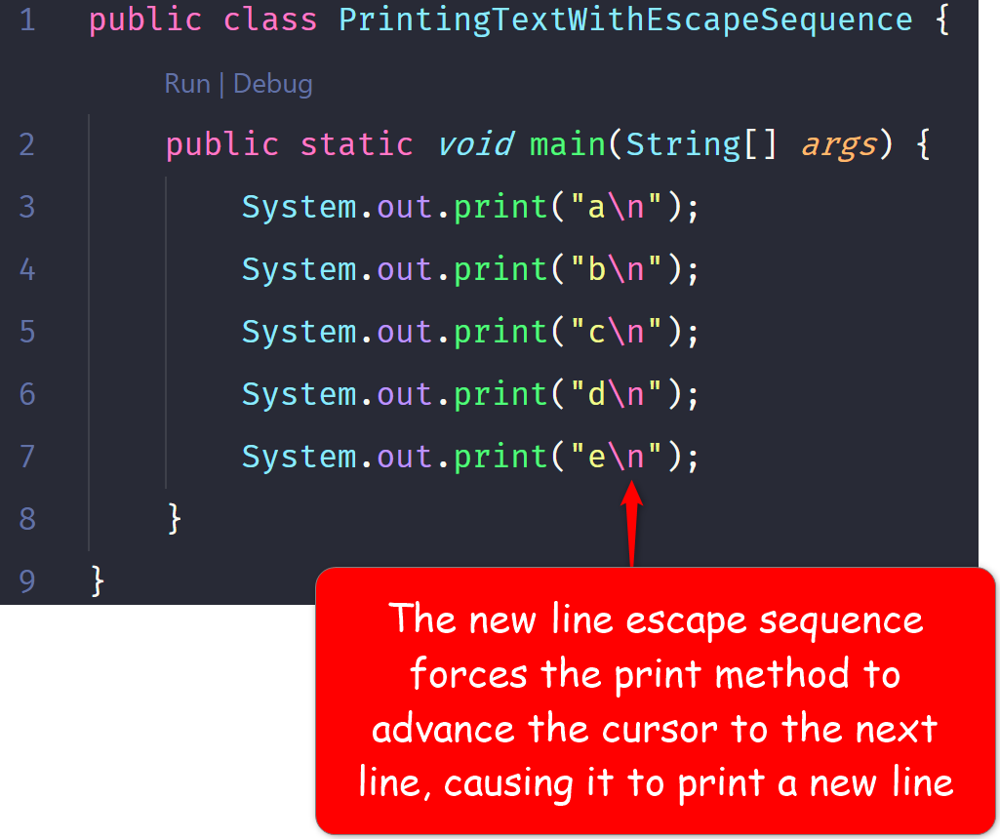
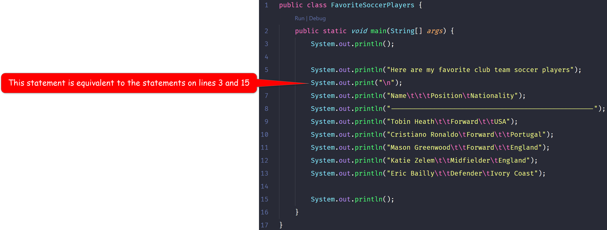

# 3. Build Your Java Foundation

| CONCEPT | A Java program (or application or app) has many moving parts that you must make some effort to understand early on in your Java career.|
| :---: | :-----------: |

In the previous lesson, I said a Java program is a class with a main method. In this lesson, I want to expand on that idea, and further introduce you to other relevant elements of a Java program. 

## 3.1 Anatomy of a Java Program

Your first step in learning Java is to learn and understand what makes up a Java program. We will explore the anatomy of a Java program by revisiting your first Java program

```java
public class MyFirstJavaProgram {
    public static void main(String[] args) {
        System.out.println("Hello, World!");
    }
}
```

### 3.1.1 A Java Program is a class

To make this idea clearer, let's slightly modify your first program by dropping the opening brace to a new line, and removing everything, but the class definition (The line with the word class in it).

> A **class** has a header and a body


> **NOTE:** It doesn't matter whether the opening brace is on the same line as the class' header or on the line below the header. However, many Java developers love having it on the same line as the class' header.

#### 3.1.1.1 A class' header

> A **class header** includes the class' name, which you choose, and a series of keywords that further defines the class.


#### 3.1.1.2 A class' body

The class' body is delimited by an opening and a closing brace. Inside a class' body is where you place the class' fields and methods. In your first program, you only have a single method, but there can be additional methods and one or more fields. We will continue to explore these as the semester moves along.

To further discuss the class' body, we will bring back the code we removed before.


If your program had fields, they would also be inside the class' body. For example:


### 3.1.2 A class does all of its work in a method

> A **method** is a named code block that contains related Java statements that perform a task. A method can accept values. A method can also return values. A method has a header and a body, just like a class.

To bring these ideas home, let's take another look at the method in your original program:


#### 3.1.2.1 A Method's header

> A **method's header** is where you specify the method's name. Just like a class' name, you choose your method's name. A method's header also includes access modifiers and other keywords to further describe the method.


#### 3.1.2.2 A Method's body

> A **method's body** is delimited by an opening brace and a closing brace. Inside the braces, you will write one or more related statements that perform some task. This task could be anything your program needs to do to fulfill its goal

```java
public static void main(String[] args) {
    System.out.println("Hello, World!");
}
```

If you have been following along, you can see that your method obviously has only one statement in its body. 

> **NOTE:** It doesn't matter if the opening brace is on the same line as your method's header, but most Java developers like it on the same line as the method's header.

The single statement in your method's body prints out some text, enclosed in double quotes, to the screen. This line is the only statement in your entire program. Notice that it's the only line in your program that actually gets the computer to do something. All other lines are necessary to set the program up, but this line actually instructs the computer to do something; that's why it's a statement, and that's why it ends with a semi-colon. The semi-colon at the end of that line serves the same purpose as the period at the end of this sentence.

While this method body only has one statement, you can write multiple statements in your method's body. In theory, there is no limit to how many statements you can write in a method's body; just make sure each statement is needed. Some statements set up data for other statements to use. Other statements use classes and methods in the Java SDK to help your program complete its task. For example, take a look at the following method body:


What's different in this method body? Lol, of course, other than the fact that there are two statements. 

Line 11 declares (or creates) a new variable called semester and assigns it (sets it equal to) the value; "Spring 2020!". Text inside double quotes is called a **string literal**.

> A **string literal** is a series of Unicode (or ASCII) characters enclosed in double quotes. They are a type of object in Java. As you can see, they are created from the String class, which is one of the classes you got when you installed the Java SDK.

If you haven't already noticed, string literals are just any text you put between double quotes. We will explore them in depth later on in the semester.

On line 12, we have our same statement for printing text to the screen; except this time, we add a string literal to the value stored in the `semester` variable. Remember that `semester` is a `String` object (because it is an instance of the `String` class). When you add a string literal to a string variable, or when you add two string literals, or when you add two string variables, it's called **concatenation**.

> **Concatenation** is when you use the + symbol to add one or more string (literal or variable) together, or to any other type of value. The result is a new string that joins all the concatenated values. <br><br> For example: `"Hello " + "world"` = `"Hello world"`

> **NOTE:** There is a blank space after `Hello`; that is why there is a blank space in the resulting string; `Hello world`.


#### 3.1.2.3 The `main` Method

I have told you earlier you get to choose the name of your methods. Well, that is partially true. Every Java program must have at least one method, named `main`. This method is the entry point to your Java program. This means when you launch an app on an Android phone (most Android apps are written in Java), the first statement that is executed in that app is triggered from the `main` method.

Because of this, the Java compiler expects this method's header to be **exactly** as follows:


Yes, it is exactly as the header you have for the main method in your first program. For now, just know that whenever I say "write an executable Java program," I mean write a class that has a method, in it, with this exact header. What you put in the body totally depends on the problem your program is meant to solve. The header, though, must look exactly as above (the colors don't matter).

If you write a class that does not have a method with this header, that class is considered a library class. The classes in the Java SDK are written without this main method. Later on, in the semester, when you learn to write your own classes, they will mostly be library classes.


#### 3.1.2.4 Comments

Sometimes when you write your programs, your algorithm may be too complex that it needs some accompanying explanation for the rationale you employed when you wrote it. In these cases, you want to express yourself in plain English. The trouble is, if you type plain English in your code, the Java compiler will have issues with it, because Java and English have very different syntax. To get around this problem, Java affords you the capability to write plain English by way of Java comments.

There are 3 types of comments. The following explains them:


#### 3.1.2.5 Summary

Here is a quick recap of concepts that may not be terribly obvious, or I may not have made obvious:

1. A class is a blueprint for an object
2. An object is a representation of a real world entity (physical or abstract) in your Java program
3. An object can have fields (attributes) and methods (behaviors)
4. The fields and methods an object can have are defined inside a class for that object
5. You use the class keyword to define a class
6. Java has several keywords that can be used to further describe a class or a method
7. A class, just like a method, has a header and a body
8. A class' body must only contain fields and methods
9. A method's body must only contain Java statements and comments
10. Statements end with a semi-colon
11. All Java keywords must be written in lowercase
12. Java is case-sensitive; therefore, public is not the same as Public
13. Every open brace must have an accompanying close brace and vice versa
14. Every open parenthesis must have an accompanying close parenthesis and vice versa
15. Here are all special characters that may have appeared in this section:
    | Character | Name | Meaning |
    | :--: | :-- | :-- |
    | `//` | Double slash | Marks the begining of a single line comment |
    | `/*` | Forward slash and asterisk | Marks the begining of a multi-line comment |
    | `*/` | Asterisk and forward slash | Marks the ending of a multi-line comment and a Java Doc comment |
    | `/**` | Forward slash and double asterisk | Marks the begining of a Java Doc comment |
    | `( )` | Opening and closing parentheses or method execution oeprator | Used in a method header and when calling a method  |
    | `{ }` | Opening and closing braces | Encloses a group of related statements (also called a **code block**), such as the contents or body of a class or a method|
    | `" "` | Opening and closing quotation marks | Encloses a string of characters, such as a message to be printed to the screen. This is also called **string literal** |
    | `;` | Semicolon | Marks the end of a complete programming thought or statement |
16. Here are places you must never put semicolon:
    


## 3.2 Printing Text to your screen

> You can use the `print` and `println` methods to display text to your screen. These methods are part of an object in the `System` class that came with the Java SDK you installed earlier.

Hopefully by now you know what the Java SDK is. In case you forgot, it is simply a collection of tools and prewritten classes you can use to efficiently write Java programs. The prewritten classes are collectively known as the **Java Application Programming Interface (or Java API)**. As mentioned before, classes in the Java API are library classes. You can use them to accomplish common tasks. One of the most common tasks you will need to accomplish is printing text to the screen.

In operating systems that have graphical user interfaces (GUIs), like Windows and Mac OS, when you display text on the screen, they appear in a **console**.

> A **console** is a dark, vintage looking, window that only knows how to display text.<br><br> Here is an example of a console.<br><br><br>On Windows, it will be your `Command Prompt` or `cmd`. ON Mac OS, it will be your `terminal`.


Like most other tasks in Java, you can accomplish printing text to your standard output (in this case, your screen) by using a class in the Java API. Classes in the Java API are available to any Java program you write. You just have to know what class does what. In fact, once you learn the basic syntax of the Java language, majority of your career will be about learning the classes in the Java API, and sometimes, writing your own classes.

For our purposes today, the class we care about is called `System`. This class contains a field in it called `out`. The `out` field is an object that represents your standard output. Just like every other object, the `out` object provides some methods that perform specific tasks. Two of those methods are the `print` and `println` methods.

> The fields and methods of a class are collectively known as **members** of the class. You use the dot (or period) operator, (`.`), to access the members (fields and methods) of a class.

So far you have seen the println statement, as in:

```java
    System.out.println("Hello, World!");
```

Below is a diagram of the relationship between the different parts of that statement:


The text you want to print to the console must be a string literal (ASCII characters inside a double quote), or a string variable, for now. Notice that the text you want to print is placed inside an opening and a closing parentheses. Do you remember what that pair of parentheses is? 


The text you "pass" to the `println` method is its **argument**.

> A **method argument** is the value(s) you provide for (or pass to) the method's parameter(s) when you call (or use) the method.

Remember when I showed you the method header? Part of the header is the parameter list. The parameter list is a place holder for the value(s) you will provide the method when you call it (calling a method is what causes it to execute its task). The `print` and `println` methods specify a single `String` parameter in their definition. This is why the argument (or value) you pass to them when you call them must be a string variable or a string literal.

> The `print` and `println` methods do provide different versions that have parameters of different data types. This is called **method overloading**, and you will learn more about it later.

### 3.2.1 `println` vs  `print`

In general, you will use the `print` and `println` methods in the same way. The only difference is, when the `println` method prints the text you specify, it also prints a new line character to your screen, causing each line of text it prints to be printed on a separate line.

**`println` example**


> **Program Output**<br><br><br><br>_**NOTE:** I usually use empty blank lines to add padding to my output_

**`print` example**


> **Program Output**<br><br>`abcde`

As you can see, even though there were 5 lines in the code, the output is on the same line; `abcde`. If you absolutely needed the output to be printed on separate lines, there are two ways you could do it:

1. **Use the println method instead of the print method**
   

   > **Program Output**<br><br>`a`<br>`b`<br>`c`<br>`d`<br>`e`

2. **Use escape sequences**
   	Besides the `println` method, you could also use an escape sequence to separate your output into separate lines.

    > An **escape sequence** is a mechanism for formatting your printed output. It starts with a backslash (\), followed by a control character. It is embedded in the text you intend to print.

    There are several escape sequences you can use with both the `print` and the `println` methods. When these methods encounter escape sequence characters, they do not print the characters; instead, they interpret them as special commands to format your output. The following table shows the most commonly used escape sequences in Java:

    | Escape Sequence | Name | Function |
    | :--: | :-- | :-- |
    | `\n` | New Line | Advances the cursor (the vertical bar you see blinking on your screen when you type) to the next line, effectively adding a new line.<br><br>This is the same character the `println` method automatically adds for you after it prints your text. |
    | `\t` | Horizontal tab | Advances the cursor a full tab length (equivalent to you pressing the tab key on your keyboard). On most systems, this is up to 4 spaces forward. |
    | `\b` | Backspace | Causes the cursor to move one space backward, or left, in left-to-right languages, or right, in right-to-left languages. |
    | `\r` | Carriage Return | Moves the cursor to the beginning of the current line. |
    | `\\` | Backslash | Prints a backslash.<br><br>Since backslash is used to escape control characters, you must use double backslash when you intend to print a backslash. |
    | `\'` | Single Quote| Single quote has a special meaning in Java. You will see that later on. If you intend to print it using the `print` and `println` methods, you must escape it by prefacing it with the backslash character. |
    | `\"` | Double Quote | You have already seen that double quotes are used to specify string literals. So if you intend to print a double quote using the `print` and `println` methods, you must escape it using the backslash character. |

    For example, suppose you needed the output from the previous example to be printed on separate lines, you would use the new line escape sequence, in the `print` method, as follows:

    
    > **Program Output**<br><br>`a`<br>`b`<br>`c`<br>`d`<br>`e`<br><br>**Notice:** The output from using the `print` method with the new line escape sequence is identical to the one with using the `println` method without the new line escape sequence. That is because appending the new line sequence character to your text is exactly what the `println` method does.

    While an escape sequence might appear to have two characters, it's actually stored as a single character in your computer's memory. The backlash is an escape (printing skips over). What actually causes formatting of your text is the control character that follows the backslash.

    

    **Let's have some fun with escape sequences. Here is a table I have created using only the print and println methods and escape sequences:**

    

    > **Program Output:**<br><br>


