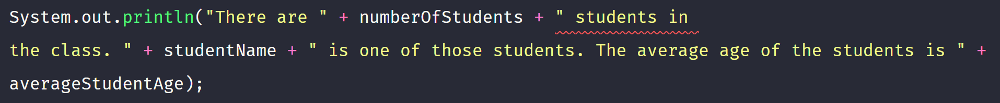
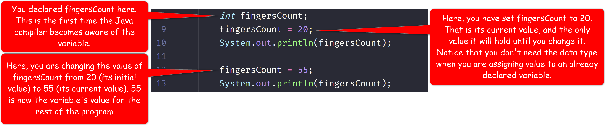
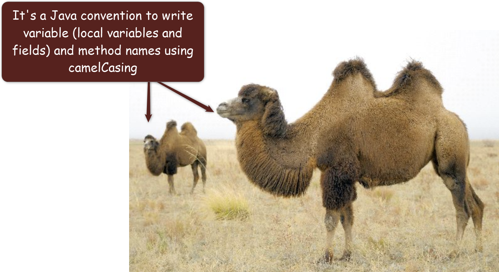

# 4. Where is my Data stored?

| CONCEPT | A variable is a named memory location. A literal is a raw value, such as a number or text, you enter into your program.|
| :---: | :-----------: |

Your computer stores your program, and all its data, in its memory. A memory, depending on its size, can have billions of locations, each with a unique numeric address (Hopefully you remember this from Lesson 1). Every time you need to represent some piece of information (data) in your program, your computer stores that information in one of its memory locations. As a developer, it's really hard for you to remember the addresses of those locations where your computer stores your data. I mean, think about it, how many of your friends' phone numbers do you know offhand? 🤷🏾‍♂️

A **variable** gives you a way to name a memory location where your data is stored. You can think of this as the name you assign to your friends' phone numbers when you save them in your phone.

For example, consider these two scenarios:

|  | VS. |  |
| :--: | :--: | :--: |

> Clearly, the name is easier to remember than the memory address

You will most certainly need to introduce data into your program. Data could be some value you collect from your user, expenses you wish to calculate in your program, or a playlist you wish to play. To effectively manage data in your program, you need variables. 

> A **variable** is a named memory location.

## 4.1 Introducing Variables in your Code

Before using a variable, you must:

1. Declare it in a **declaration statement**
2. Assign it a value in an **assignment statement**
3. Or complete steps 1 and 2 at once, in a **variable initialization statement**

In this section, you will study each of the above statements. To get some visual explanation, please review the following code:

One thing I want you to notice about each of these 3 methods of introducing a new variable in your code is the semicolon at the end of each line. These are statements. They instruct your computer to allocate enough space in memory to store your data. How much space your computer allocates depends on the data type of the variable. You will learn all the different data types in the next lesson.

Before using any variable, you must ensure you have declared it and that you have given it (assign it) a value. The value can be a literal or another variable of compatible data type.

### 4.1.1 Pay attention to your double quotes when variables are involved

If you put your variable name in double quotes, the Java compiler will consider it a String literal (You'll learn what that is in a minute). As such, the variable's name; not its content, will be considered the value.

E.g.

> **Program Output**  `The student's name is studentName`

To use the value of the variable in your code instead of its name, you must not enclose the variable's name in double quotes. Here is the same program without the quotes:

> **Program Output**  `The student's name is DiNatale, Naida L.`

### 4.1.2 Literals

A **literal** is any recognizable value you enter in your code. For example, your age is a value. If you entered it in your code, it will be a literal. Literals are mostly commonly assigned to variables in an assignment statement or in a variable initialization statement. Literals may also be passed as arguments to methods, as we have been doing all along; passing string literals to the `print` and `println` methods to display them. 

Below is the same code from above, but with focus on the literals:

All the text you see enclosed in double quotes are literals; more specifically, they are **string literals**. One thing I want you to notice about literals is that string literals are always enclosed in double quotes, but the integer literal, 28, is not enclosed in any quotes. That's because it's a number. You will see different types of literals in the data type lesson.

### 4.1.3 String Concatenation

When the `+` operator is used to combine multiple strings, it's called a **string concatenation operator**. String concatenation combines multiple strings into a single string. When you combine a string literal (or variable) with any other type of value, you get a new string that combines those values.

For example,

> **Program Output**  

When you combine a string literal and a string variable, you get a new string that combines the string literal and the content of the string variable.

> **Program Output**  

When you concatenate a string with a any other value, you get a new string. You always get a string from string concatenation. If you combine multiple types of values, as long as one of those values is a string, that operation is a string concatenation and the result you get is a string value.

> **Program Output**  `There are 28 students in the class. Koo, Grace D. is one of those students. The average age of the students is 18`

> Even though the `println` statement has `String` variable, `int` variable and string literals as its argument, the result is a string combining all the values.

Sometimes the argument you pass to the `print` and `println` statements might be too long to fit on a single line. However, keep in mind that a string literal cannot begin on one line and end on another line. What you see above is a trick of the code editor's wrap column feature. 

For example, the following is an error, as the code editor is rightly pointing out:

That error occurred because I explicitly put my cursor between the words, "in" and "the" and hit the Enter key on my keyboard. That action adds a whitespace that causes the string literals to appear on separate lines, causing the error.

If you want your text to wrap, there are two ways you can fix this. You can put your cursor right before or after the concatenation operator (`+`) and press your Enter key:

Or, you can set VS Code to wrap your text after certain number of characters on a given line. That's the setting I'm using to give the impression my string literal is spanning multiple lines.

To set VS Code, go to File -> Preferences -> Settings, or use short key combination; `Ctrl+,` on Windows or `Cmd+,` on Mac.
> This means, hold down the Ctrl/Command key and press the comma (,) key on your keyboard

### 4.1.4 Common Mistakes to avoid

1. **Always close opening braces, parentheses, and/or quotation marks** You know that the body of a class and the body of a method are enclosed inside braces. String literals are enclosed inside quotation marks, and method parameter lists are enclosed inside parentheses. Those symbols come in pairs. The left symbol is the opening and the right symbol is the closing. You must always close a brace, a parenthesis or a quotation mark when you open one. Otherwise, your code will not compile.

2. **Never misspell keywords** Keywords are mostly short, single and reserved words. Please do your best **never** to misspell them. Your code will not compile if you do.

3. **Always ensure keywords are spelled with lowercase letters** Every keyword, in Java, is spelled with lowercase letters. You must **never** spell keywords with uppercase letters. If you do, your code will not compile

4. **Never use a keyword as an identifier** Remember that an identifier is the name you assign to elements like classes, methods, fields and variables. You must **never** use a Java keyword as a variable name or as any other identifier. If you do, your code will not compile.

5. **Always remember that Java is case-sensitive** Java is case-sensitive. This means identifiers that only differ by capitalization are completely different. Every time you use an identifier, you must use the exact name you specified when you first created (or declared) it. For example, if you named a variable ``absoluteValue`, whenever you want to refer to that variable, you must use the exact spelling and capitalization. You will introduce bugs in your code if you play fast and loose with identifiers.

6. **Always obey the Java rules for defining your identifiers** Whenever you declare an identifier, a class, a method, a field, or a variable, make sure the name follows the Java rules. Never add space in an identifier. Never start an identifier with a number, etc. If you do, your code will not compile

7. **Always terminate a complete statement with semi-colon** Make sure to practice identifying what is or is not a statement. Always end your statements with a semi-colon. If you don't, your code will not compile

8. **A variable can only hold one value at a time** Do not mistakenly modify a variable, thinking it can hold multiple values at the same time. When you declare a variable, it can only hold one value at a time. The current value of your variable is the last value assigned to it, using the `=` (assignment operator).  For example: 

## 4.2 Identifiers

> An **Identifier** is any name you get to assign to a programming element, like a variable, a class, or a method. 

Besides the Java keywords, identifiers are the only other named elements in your program. Because you get to name them, the names you choose are totally arbitrary and they can come from any part of your head. 😁

To be a good Java developer though, it's a good practice to name your identifiers to clearly identify the concept you desire to represent in your program. Always pick names that will make it stupidly obvious for anyone reading your code to determine what that identifier represents. For example, when writing a program, give the program class a name that reflects what the program does. When naming a variable, give it a name that easily identifies what data is stored in it. 

The following are really bad variable names: `x`, `foo`, `abc`.

**Good question, Terry.** While those variable names are simple, they say nothing about the value they hold. What value, in the real world, could you possibly represent in a variable called `x`?

**Consider this:** If you are working on an accounting program that calculates your monthly expenses, how much value do you think adding a variable called `x` would add to your program? Conversely, how much value do you think adding a variable called `weeklyExpenses` adds to your program?

If you weighed those two variable names objectively, you would clearly see that not all variable names are created equal.

### 4.2.1 Casing of Identifier Names

You must have probably noticed I've used inconsistent casing for the identifiers I've used so far, in my programs. Sometimes you see some identifier names start with a lowercase letter, while other times you see they start with an uppercase letter. Well, it turns out, there is a method to my madness. 😜. Bear with me.

In camel casing, the first letter of the identifier name begins with a lowercase letter. If there are multiple words, the first word begins with a lowercase letter and every subsequent word begins with an uppercase letter.

E.g. `firstName`, `doctor`, `doctorsAppointment`, `oliversGoodKitchen`

For classes, you use a type of camel casing called **PascalCasing**. Pascal Casing is camel casing where the first letter is upper case. 

E.g. `Person`, `ElectronicComputer`, `EmpireStrikesBackGuard`.

You can clearly see that the case differentials make the identifier names easier to read. So naming things this way is not only cool; it's also practical! 🙌🏾🙌🏾🙌🏾

### 4.2.2 Parts of Speech of Identifier names

It's a convention to use nouns for class names when the class name has only one word. If there are multiple words, then the first word should be an Adjective/Adverb. 

E.g. `Professor`, `TenuredProfessor`.

For variable names, they are usually nouns or linking verbs depending on how they are used. You will learn more about this later.

As for methods, because they represent action, they should be named using action/linking verbs. For example, a method that calculates your GPA should be named, `calculateGpa`.

### 4.2.3 Java Enforced Rules

Well, all the rules I have specified above have been termed as conventions. Conventions are a way developers establish a common understanding about certain concepts. The Java compiler, on the other hand, cares very little about conventions. In fact, the Java compiler does not enforce any of the conventions mentioned above. It does; however, enforce its own rules that it has about identifiers. The following are identifier naming rules you must obey for your code to compile:

1. The first character **must** be one of the letters a–z or A–Z, an underscore (_), or a dollar sign ($). 
2. After the first character, you may use the letters a–z or A–Z, the digits 0–9, underscores (_), or dollar signs ($). 
3. Uppercase and lowercase characters are distinct. This means `itemsOrdered` is not the same as `itemsordered`. 
4. Identifiers **must** not include spaces.
5. Identifiers **must** only be defined once in a given scope (you will learn more about scopes later)
Identifiers can only be used within the scope where they are visible (remember the access modifiers public and private?)

> **NOTE:** While the `$` is a valid character to use in an identifier name, I encourage you to avoid it, because `$` is normally used for special purposes in most programming languages.
