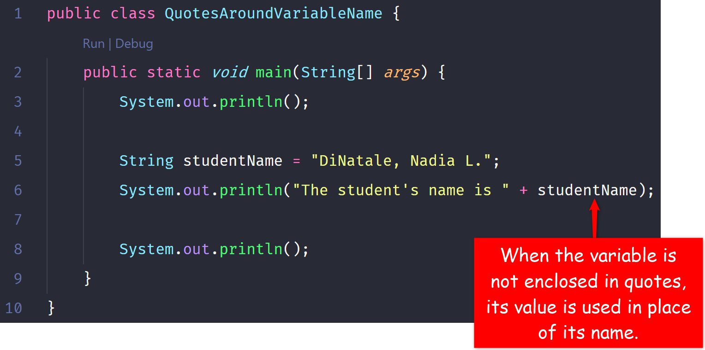

# 4. Where is my Data stored?

| CONCEPT | A variable is a named memory location. A literal is a raw value, such as a number or text, you enter into your program.|
| :---: | :-----------: |

Your computer stores your program, and all its data, in its memory. A memory, depending on its size, can have billions of locations, each with a unique numeric address (Hopefully you remember this from Lesson 1). Every time you need to represent some piece of information (data) in your program, your computer stores that information in one of its memory locations. As a developer, it's really hard for you to remember the addresses of those locations where your computer stores your data. I mean, think about it, how many of your friends' phone numbers do you know offhand? 🤷🏾‍♂️

A **variable** gives you a way to name a memory location where your data is stored. You can think of this as the name you assign to your friends' phone numbers when you save them in your phone.

For example, consider these two scenarios:

|  | VS. |  |
| :--: | :--: | :--: |

> Clearly, the name is easier to remember than the memory address

You will most certainly need to introduce data into your program. Data could be some value you collect from your user, expenses you wish to calculate in your program, or a playlist you wish to play. To effectively manage data in your program, you need variables. 

> A **variable** is a named memory location.

## 4.1 Introducing Variables in your Code

Before using a variable, you must:

1. Declare it in a **declaration statement**
2. Assign it a value in an **assignment statement**
3. Or complete steps 1 and 2 at once, in a **variable initialization statement**

In this section, you will study each of the above statements. To get some visual explanation, please review the following code:

One thing I want you to notice about each of these 3 methods of introducing a new variable in your code is the semicolon at the end of each line. These are statements. They instruct your computer to allocate enough space in memory to store your data. How much space your computer allocates depends on the data type of the variable. You will learn all the different data types in the next lesson.

Before using any variable, you must ensure you have declared it and that you have given it (assign it) a value. The value can be a literal or another variable of compatible data type.

### 4.1.1 Pay attention to your double quotes when variables are involved

If you put your variable name in double quotes, the Java compiler will consider it a String literal (You'll learn what that is in a minute). As such, the variable's name; not its content, will be considered the value.

E.g.

> **Program Output**  `The student's name is studentName`

To use the value of the variable in your code instead of its name, you must not enclose the variable's name in double quotes. Here is the same program without the quotes:

> **Program Output**  `The student's name is DiNatale, Naida L.`

### 4.1.2 Literals

A **literal** is any recognizable value you enter in your code. For example, your age is a value. If you entered it in your code, it will be a literal. Literals are mostly commonly assigned to variables in an assignment statement or in a variable initialization statement. Literals may also be passed as arguments to methods, as we have been doing all along; passing string literals to the `print` and `println` methods to display them. 

Below is the same code from above, but with focus on the literals:

All the text you see enclosed in double quotes are literals; more specifically, they are **string literals**. One thing I want you to notice about literals is that string literals are always enclosed in double quotes, but the integer literal, 28, is not enclosed in any quotes. That's because it's a number. You will see different types of literals in the data type lesson.

### 4.1.3 String Concatenation

When the `+` operator is used to combine multiple strings, it's called a **string concatenation operator**. String concatenation combines multiple strings into a single string. When you combine a string literal (or variable) with any other type of value, you get a new string that combines those values.

For example,

> **Program Output**  

When you combine a string literal and a string variable, you get a new string that combines the string literal and the content of the string variable.

> **Program Output**  

When you concatenate a string with a any other value, you get a new string. You always get a string from string concatenation. If you combine multiple types of values, as long as one of those values is a string, that operation is a string concatenation and the result you get is a string value.

> **Program Output**  `There are 28 students in the class. Koo, Grace D. is one of those students. The average age of the students is 18`

> Even though the `println` statement has `String` variable, `int` variable and string literals as its argument, the result is a string combining all the values.

Sometimes the argument you pass to the `print` and `println` statements might be too long to fit on a single line. However, keep in mind that a string literal cannot begin on one line and end on another line. What you see above is a trick of the code editor's wrap column feature. 

For example, the following is an error, as the code editor is rightly pointing out:

That error occurred because I explicitly put my cursor between the words, "in" and "the" and hit the Enter key on my keyboard. That action adds a whitespace that causes the string literals to appear on separate lines, causing the error.

If you want your text to wrap, there are two ways you can fix this. You can put your cursor right before or after the concatenation operator (`+`) and press your Enter key:

Or, you can set VS Code to wrap your text after certain number of characters on a given line. That's the setting I'm using to give the impression my string literal is spanning multiple lines.

To set VS Code, go to File -> Preferences -> Settings, or use short key combination; `Ctrl+,` on Windows or `Cmd+,` on Mac.
> This means, hold down the Ctrl/Command key and press the comma (,) key on your keyboard

