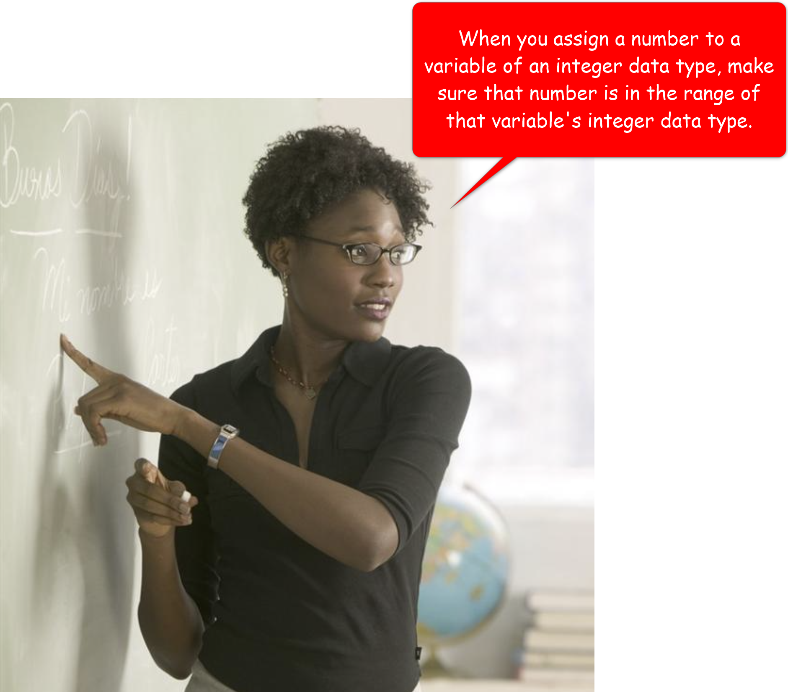

# 5. Representing your data in Code

| CONCEPT | When you represent data in your program, you use a variable. Your variable must have a data type in its declaration. A variable's data type specifies what kind of data you can store in it, and how much space your computer must allocate in its memory to store that data. |
| :--: | :--: |

When you write a program, all you are really doing is collecting some data that you manipulate to accomplish a task. 

As the developer, you must strive to understand the kinds of data your program is most likely to encounter. This enables you to declare your variables with the correct data types. Declaring variables with their correct data type is very important, as it dictates how your computer allocates its memory. 

For example, if you are writing a program that calculates distances in space, you want to declare variables that can hold large and accurate numbers. On the other hand, if you are writing a program that catalogs lab experiments involving microscopic organisms, you probably want to use variables that can hold small and accurate numbers. 

In each case, the variables you declare must have the correct data type; otherwise, your computer will be allocating its memory in the wrong way, thereby causing your program to perform poorly and ultimately, pissing your users off 😠.

> A **data type** is a programming construct that restricts the kind of data you can store in a variable, and the operations you can perform on that variable. Data types come in two categories. **Primitive data types** and **reference (or complex or object) data types**.


In this lesson, we will focus on **primitive data types**. Primitive data types are so called because they are already in their simplest form. In the previous lesson, you learned that objects have fields (data) and methods (operations). This is because objects are a complex form of data. Primitive data types, on the other hand, are simply data. While they do have operations you can perform on them, you can't, for example, use the dot (.) operator on a primitive variable, _a variable declared with a primitive data type_, to access its methods and fields, since it doesn't have those.

Primitive data types are further categorized into **numeric**, **Boolean** and **character** data types.

## 5.1 NUmeric Data Types

The numeric data types, in Java, comprise of **integer** (or whole numbers) and **floating-point** (numbers with decimal places) numbers.

The following table lists all the available numeric data types in Java:
| Data Type Keyword | Size in Memory | Range of Numbers the Variable can hold |
| :-- | :-- | :-- |
| `byte` | 1 byte |	Integers in the range of: `-128` to `+127` |
| `short` |	2 bytes	| Integers in the range of: `-32,768` to `+32,767` |
| `int` | 4 bytes |	Integers in the range of: `−2,147,483,648` to `+2,147,483,647` |
| `long` | 8 bytes | Integers in the range of: `−9,223,372,036,854,775,808` to `+9,223,372,036,854,775,807` |
| `float` | 4 bytes |	Floating-point numbers in the range of: `±3.4×10−38` to `±3.4×1038`, with 7 digits of accuracy |
| `double` | 8 bytes | Floating-point numbers in the range of: `±1.7×10−308` to `±1.7×10308`, with 15 digits of accuracy |

You already know how to declare a variable. In case you forgot, the following diagram shows the syntax of a **variable declaration statement**:


A variable declaration statement is used to introduce a new variable into your program.

If you need to declare a variable that stores a numeric value, you will use one of the keywords from the **Data Type Keyword** column in the above table in place of the **data type** box in the syntax. Then you will provide an identifier for your variable's name. Finally, you will terminate the statement with a semi-colon.

**E.g. Declare a variable for storing the distance between earth and the moon**


-----------------


The above example shows how to declare a single variable in a single declaration statement. You can also declare multiple variables, of the same data type, in a single statement:

**E.g.**
```java
double distanceFromEarthToTheMoonInMiles, distanceFromEarthToMarsInMiles, distanceFromEarthToJupiterInMiles;
```

If you want, you can also span the variable names on separate lines:
```java
double distanceFromEarthToTheMoonInMiles, 
       distanceFromEarthToMarsInMiles, 
       distanceFromEarthToJupiterInMiles;
```

Notice how the variable names are separated with commas. Also notice that a line is not the same as a statement. A statement expresses a complete thought in Java. A line is just characters that happen to share horizontal space. You can have multiple statements on the same line, as long as you separate them with semi-colons.

**E.g.**
```java
double age; double height;
```

You can choose to have those two statements as separate lines, as follows:
```java
double age; 
double height;
```

_FYI: I encourage you to keep your statements on separate lines_

------


### 5.1.1 Integer Data Types

| Data Type Keyword | Size in Memory | Range of Numbers the Variable can hold |
| :-- | :-- | :-- |
| `byte` | 1 byte |	Integers in the range of: `-128` to `+127` |
| `short` |	2 bytes	| Integers in the range of: `-32,768` to `+32,767` |
| `int` | 4 bytes |	Integers in the range of: `−2,147,483,648` to `+2,147,483,647` |
| `long` | 8 bytes | Integers in the range of: `−9,223,372,036,854,775,808` to `+9,223,372,036,854,775,807` |

**Integer data types are used to represent whole numbers** (numbers with no decimal places), such as `17`, `128`, `33`, `56`, in your program. Each data type in the above table can be used to store a whole number. The only difference between them is their size; that is, how big of a number they can represent.

The following code describe how to create and use integer variables.


> **Program Output**<br><br>

**Integer Literals**

In case you forgot, **a literal is a value you write in your code**. Every data type has its own literal. For the integer data types, their literal is pretty much any number that falls in their range, as shown in the table above.

So, a byte literal would be any number that falls in the range; `-128` to `+127`. A short literal is any number that falls in the range; `-32,768` to `+32,767`. And so on.

Having said that, there are two very important facts I want to point out:

1. By default, Java considers any whole number in your code as an `int` literal. The reason for this should be obvious, but in case it's not to you, here is why: every integer literal of all the other integer data types (except `long`) falls in the range of the `int` data type. Ergo, while `1` is a `byte` literal, it's an `int` literal first. As a result, Java considers it an `int` literal.<br><br>If you want to explicitly specify that a number is a `long` literal, you must append "L" to the number. Small case "l" also works, but its similarity to the number, `1`, can cause confusion in some type faces. So, I advise you stick to using the uppercase L.<br><br>**E.g.**<br>

2. When you assign large numeric literals to an integer variable, you might be tempted to separate the units of the numbers with commas. For example, you might be tempted to write `3267`8 as `32,678`. Yeah, don't do that! 😕. <br><br>For example:<br><br><br>If you want to separate your units, use an underscore.<br><br>For example:<br>

> 
