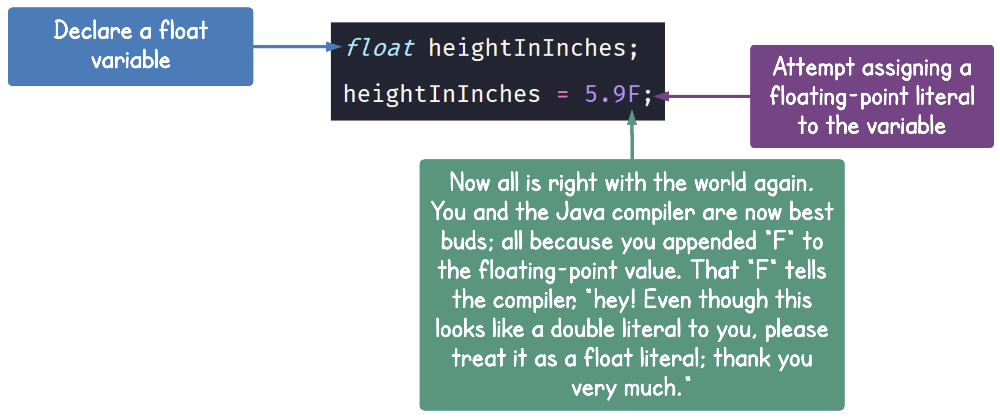

# 5. Representing your data in Code

| CONCEPT | When you represent data in your program, you use a variable. Your variable must have a data type in its declaration. A variable's data type specifies what kind of data you can store in it, and how much space your computer must allocate in its memory to store that data. |
| :--: | :--: |

When you write a program, all you are really doing is collecting some data that you manipulate to accomplish a task. 

As the developer, you must strive to understand the kinds of data your program is most likely to encounter. This enables you to declare your variables with the correct data types. Declaring variables with their correct data type is very important, as it dictates how your computer allocates its memory. 

For example, if you are writing a program that calculates distances in space, you want to declare variables that can hold large and accurate numbers. On the other hand, if you are writing a program that catalogs lab experiments involving microscopic organisms, you probably want to use variables that can hold small and accurate numbers. 

In each case, the variables you declare must have the correct data type; otherwise, your computer will be allocating its memory in the wrong way, thereby causing your program to perform poorly and ultimately, pissing your users off 😠.

> A **data type** is a programming construct that restricts the kind of data you can store in a variable, and the operations you can perform on that variable. Data types come in two categories. **Primitive data types** and **reference (or complex or object) data types**.


In this lesson, we will focus on **primitive data types**. Primitive data types are so called because they are already in their simplest form. In the previous lesson, you learned that objects have fields (data) and methods (operations). This is because objects are a complex form of data. Primitive data types, on the other hand, are simply data. While they do have operations you can perform on them, you can't, for example, use the dot (.) operator on a primitive variable, _a variable declared with a primitive data type_, to access its methods and fields, since it doesn't have those.

Primitive data types are further categorized into **numeric**, **Boolean** and **character** data types.

## 5.1 NUmeric Data Types

The numeric data types, in Java, comprise of **integer** (or whole numbers) and **floating-point** (numbers with decimal places) numbers.

The following table lists all the available numeric data types in Java:
| Data Type Keyword | Size in Memory | Range of Numbers the Variable can hold |
| :-- | :-- | :-- |
| `byte` | 1 byte |	Integers in the range of: `-128` to `+127` |
| `short` |	2 bytes	| Integers in the range of: `-32,768` to `+32,767` |
| `int` | 4 bytes |	Integers in the range of: `−2,147,483,648` to `+2,147,483,647` |
| `long` | 8 bytes | Integers in the range of: `−9,223,372,036,854,775,808` to `+9,223,372,036,854,775,807` |
| `float` | 4 bytes |	Floating-point numbers in the range of: `±3.4×10−38` to `±3.4×1038`, with 7 digits of accuracy |
| `double` | 8 bytes | Floating-point numbers in the range of: `±1.7×10−308` to `±1.7×10308`, with 15 digits of accuracy |

You already know how to declare a variable. In case you forgot, the following diagram shows the syntax of a **variable declaration statement**:


A variable declaration statement is used to introduce a new variable into your program.

If you need to declare a variable that stores a numeric value, you will use one of the keywords from the **Data Type Keyword** column in the above table in place of the **data type** box in the syntax. Then you will provide an identifier for your variable's name. Finally, you will terminate the statement with a semi-colon.

**E.g. Declare a variable for storing the distance between earth and the moon**


-----------------


The above example shows how to declare a single variable in a single declaration statement. You can also declare multiple variables, of the same data type, in a single statement:

**E.g.**
```java
double distanceFromEarthToTheMoonInMiles, distanceFromEarthToMarsInMiles, distanceFromEarthToJupiterInMiles;
```

If you want, you can also span the variable names on separate lines:
```java
double distanceFromEarthToTheMoonInMiles, 
       distanceFromEarthToMarsInMiles, 
       distanceFromEarthToJupiterInMiles;
```

Notice how the variable names are separated with commas. Also notice that a line is not the same as a statement. A statement expresses a complete thought in Java. A line is just characters that happen to share horizontal space. You can have multiple statements on the same line, as long as you separate them with semi-colons.

**E.g.**
```java
double age; double height;
```

You can choose to have those two statements as separate lines, as follows:
```java
double age; 
double height;
```

_FYI: I encourage you to keep your statements on separate lines_

------


### 5.1.1 Integer Data Types

| Data Type Keyword | Size in Memory | Range of Numbers the Variable can hold |
| :-- | :-- | :-- |
| `byte` | 1 byte |	Integers in the range of: `-128` to `+127` |
| `short` |	2 bytes	| Integers in the range of: `-32,768` to `+32,767` |
| `int` | 4 bytes |	Integers in the range of: `−2,147,483,648` to `+2,147,483,647` |
| `long` | 8 bytes | Integers in the range of: `−9,223,372,036,854,775,808` to `+9,223,372,036,854,775,807` |

**Integer data types are used to represent whole numbers** (numbers with no decimal places), such as `17`, `128`, `33`, `56`, in your program. Each data type in the above table can be used to store a whole number. The only difference between them is their size; that is, how big of a number they can represent.

The following code describe how to create and use integer variables.


> **Program Output**<br><br>

**Integer Literals**

In case you forgot, **a literal is a value you write in your code**. Every data type has its own literal. For the integer data types, their literal is pretty much any number that falls in their range, as shown in the table above.

So, a byte literal would be any number that falls in the range; `-128` to `+127`. A short literal is any number that falls in the range; `-32,768` to `+32,767`. And so on.

Having said that, there are two very important facts I want to point out:

1. By default, Java considers any whole number in your code as an `int` literal. The reason for this should be obvious, but in case it's not to you, here is why: every integer literal of all the other integer data types (except `long`) falls in the range of the `int` data type. Ergo, while `1` is a `byte` literal, it's an `int` literal first. As a result, Java considers it an `int` literal.<br><br>If you want to explicitly specify that a number is a `long` literal, you must append "L" to the number. Small case "l" also works, but its similarity to the number, `1`, can cause confusion in some type faces. So, I advise you stick to using the uppercase L.<br><br>**E.g.**<br>

2. When you assign large numeric literals to an integer variable, you might be tempted to separate the units of the numbers with commas. For example, you might be tempted to write `3267`8 as `32,678`. Yeah, don't do that! 😕. <br><br>For example:<br><br><br>If you want to separate your units, use an underscore.<br><br>For example:<br>

> 

### 5.1.2 Floating-Point Data Types


In programming terms, a **floating-point number** is any number that has a fractional part. I think you will recognize the following number as what I call the most famous floating-point number:


Pi is very important to pretty much any calculation involved in our understanding of the universe. If you only had integer data types, there would be no way to represent Pi in your computer programs. 

Lucky for you, Java provides 2 other numeric data types for representing floating-point numbers in your code:

| Data Type Keyword | Size in Memory | Range of Numbers the Variable can hold |
| :-- | :-- | :-- |
| `float` | 4 bytes |	Floating-point numbers in the range of: `±3.4×10−38` to `±3.4×1038`, with 7 digits of accuracy |
| `double` | 8 bytes | Floating-point numbers in the range of: `±1.7×10−308` to `±1.7×10308`, with 15 digits of accuracy |


Floating-point numbers are not only valuable because they can represent fractional numbers, they are also important because they can represent a level of accuracy that whole numbers simply can't. 

For example, if you stored the value of PI in a long variable, while that variable will have enough space to store the whole number part of the value, you will lose the accuracy captured in the fractional part. 

In fact, Java requires a special syntax for forcing a whole number data type, like long, to store a floating-point value, like PI.

**E.g. Storing a floating-point value in a whole number variable**


> **Program Output**<br><br>

**Magnitude vs. Accuracy of numbers**

Floating-point numbers give us the perfect opportunity to take a tangent and talk about the **magnitude** and **accuracy** of numbers. Our entire scientific world is based on observation and experimentation. As such, we are always dealing with measurements. We measure mainly because we want to ascertain accuracy. 

> **Accuracy (or precision)** is how close a measurement (the value stored in a variable) is to the correct value (the value that occured in nature). 

For example, we know the value of pi to be `3.141592653589793238462643…`. As a result, the most accurate values of pi are the ones with the most significant figures (digits after the decimal point). Ergo, `3.14159` is more accurate than `3.14`. And `3.14` is more accurate than simply `3`.

To handle this level of accuracy, Java gives us the `float` and `double` data types. Double variables can hold more accurate numbers because they can represent more significant digits (decimal places).

Consider the following table. In the left column, we declare a `double` variable called `pi` and set it to a value of `pi`, up to 24 digits. In the right column, we do the same, except with a `float` variable. I want you to pay close attention to the results in both columns. 

| Double | Float |
| :--: | :--: |
|  |  |
|**Double Accuracy Output**<br><br> | **Float Accuracy Output**<br><br> |

> **Magnitude** is how large a number is.

The concept of magnitude is a little more intuitive. I mean after all, we all know 3 is greater than 4 and 5 is greater than 4. So by magnitude, if you think of long and double variables as water containers, they will hold about the same amount of water. However, by accuracy, a double container will hold a far more accurate value than a long container.

**Floating-point Literals**

Hopefully by now you are getting the hang of literals. Floating-point literals have decimal places. That is, they have a whole number part and a decimal (or fractional) part, separated by a decimal point (.).

By default, Java considers any floating-point number you enter in your code as a `double` literal. So. numbers like `3.1415` and `9.8` will be considered `double` literals. To specify that a floating-point literal is a `float` literal, you must append "f" or "F" to the number (not both. Pick one and stick with it). The reason for specifying "F" to indicate a `float` literal is the same as the one for specifying "L" to indicate `long` literal.

**E.g. Assigning a floating-point literal to a `double` variable:**


**E.g. Incorrectly assigning a floating-point literal to a `float` variable:**


To fix your error, you need to append "F" to the floating-point value.

**E.g. Correctly assigning a floating-point literal to a `float` variable**



You can also use scientific notations as floating-point literals. For example, consider the following values:

| Gravitational constant; G |
| :--: |
| `6.67430 x 10^-11 m^2/kgs^2` |


| Distance to the sun from earth in meters |
| :--: |
| `1.495979 x 10^11m` |


| Mass of earth in kilogram |
| :--: |
| `5.972 x 10^24 kg` |

Each of these values are very important, especially to astrophysicists and theoretical physicists (they are pretty much people who study what goes on in space and try to explain it using Math). As a result, many programs written for space exploration use them, a lot!

To represent these numbers in your code, simply replace "x 10" with "e" or "E". The new value you get is the E-Notation equivalent of the scientific notation. 

**For example:**

| Scientific Notation | E Notation |
| :-- | --: |
| `6.67430 x 10^-11` | `6.67430E-11` |
| `1.495979 x 10^11` | `1.495979e11` |
| `5.972 x 10^24` | `5.972E24` |

In your Java code, you must only use the E-Notation to assign floating-point literals to floating-point variables in the event you need to use scientific notations.

**E.g. Representing E-Notation in code:**


Go ahead. Try. The. Code. Out!

## 5.2 The Boolean Data Type

| Data Type Keyword | Size | Range of values the Variable can Hold |
| :--: | :--: | :--: |
| `boolean` |	Represents `1 bit` of data, but its size isn't precisely defined | `true` or `false` |

A **Boolean** (capital B because it's named after someone; George Boole, to be specific) is used to represent the values true and false. It doesn't get simpler than that, 🙌🏾. When you create a Boolean variable, you can only store one of those values in it; never both. Those values are called **Boolean expressions** or **Boolean literals**. They are useful when you need to evaluate conditions that are either true or false. In effect, they are used to evaluate the truthfulness of a condition. 

> A **Boolean expression** is any expression or condition that evaluates to either true or false. A **condition** is a requirement within your code.


**Quick Words about the Boolean Data Type**

1. The keyword is `boolean` (small b).
2. When naming Boolean variables, try to preface them with linking verbs. The idea is that these variables provide a true or false answer to a question.<br>E.g. `isValid`, `canRun`
3. The Boolean literals are `true` and `false`. They are written in lowercase letters because they are also Java keywords.
4. `"true"` and `"false"` are `String` literals, while `true` and `false` are Boolean literals. Do not confuse the two sets of literals. You can't assign a Boolean literal to any variable of any other data type. Similarly, you can't assign a `String` literal to any variable of any other data type.

## 5.3 The Character Data Type

| Data Type Keyword | Size | Range of values the Variable can Hold |
| :--: | :--: | :-- |
| `char` | 2 bytes | The 16-bit Unicode character set, numerically represented in the range: `0` (or `'\u0000'`) to `65,535` (or `'\uffff'`) |

The character data type, keyword `char`, is used to represent characters in the 16-bit Unicode character set. You already know what the Unicode character set is. See _Lesson 1 (Unicode Character Set)_ in case you forgot. While Unicode characters in real life can go up to 32 bits, Java only supports a subset of Unicode characters, from `0` to `65,535`. That's still a large range to represent lots of different characters!

### 5.3.1 Character Literals

A character literal is simply a Unicode character enclosed in single quotes:

**E.g.**


Because characters are ultimately stored in your computer's memory as numbers, you can, technically, use the integer literals in the range of `0` to `65,535` as character literals.

**For example:**


The output of this code, when you run it, will be…, wait for it, `A`. Remember that `A` is the corresponding Unicode character for the number `65`.

Notice that you can't fool the Java compiler when using integer literals as character literals. If you attempt to store any integer value outside the character literal range of `0` to `65,535`, the compiler will yell at you.

**For example:**


Finally, you can also use hexadecimal values for character literals:


The output of this code is A, just like it was previously. You can find the hexadecimal value of the Unicode characters in the Unicode table [here](https://unicode-table.com/en/ "Unicode Table with Hexadecimal Values").


